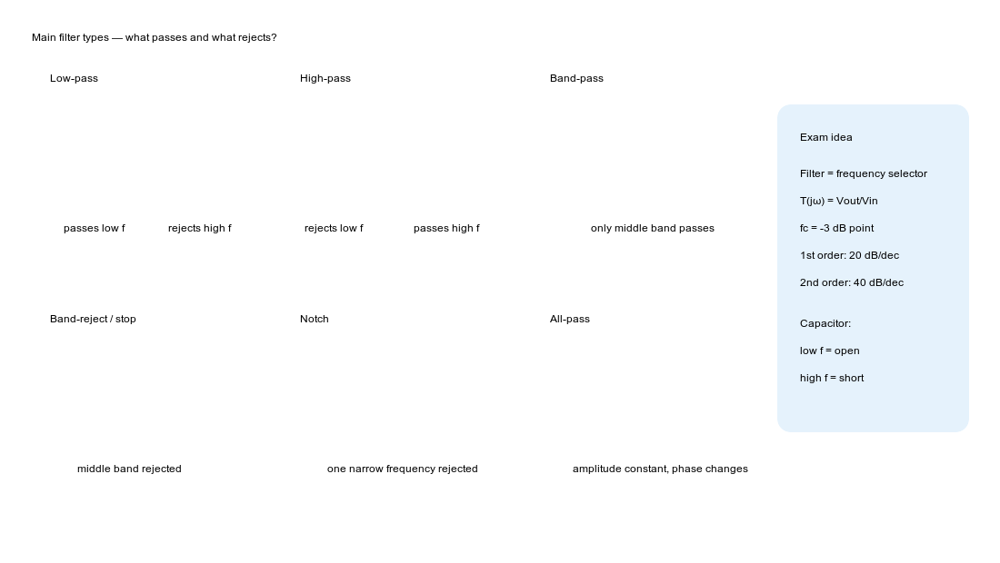
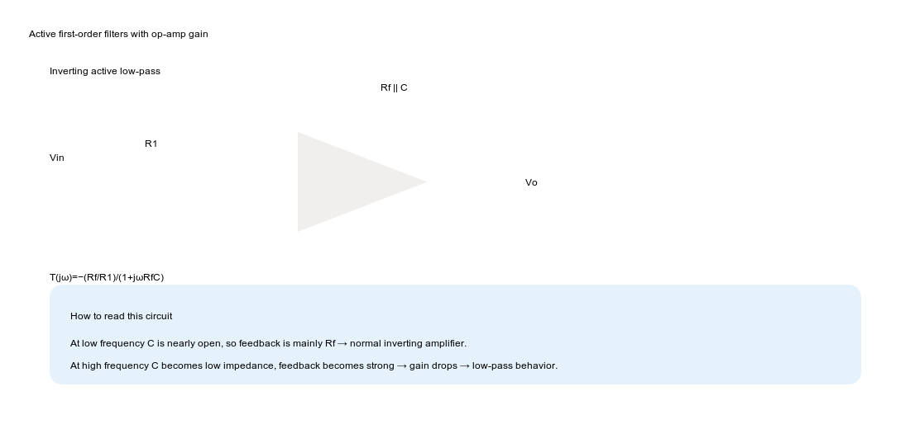
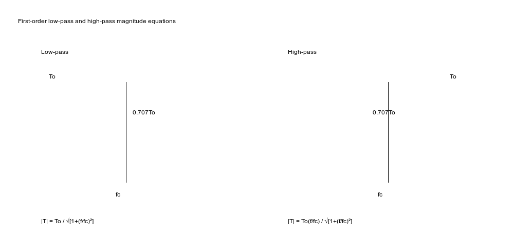
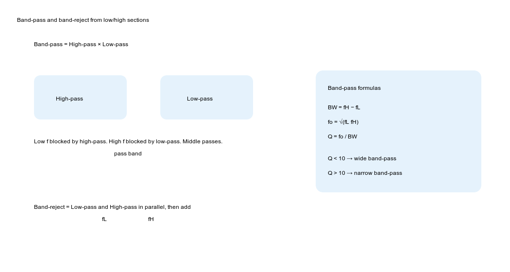
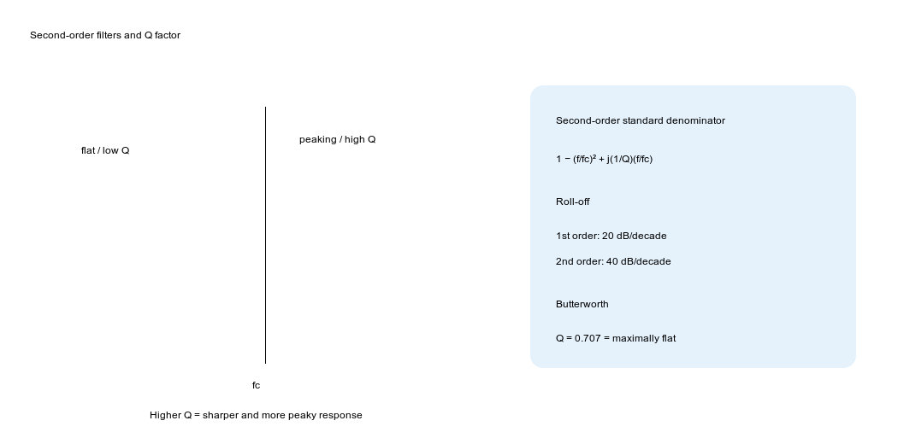
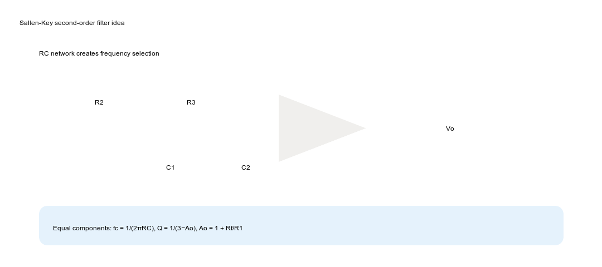
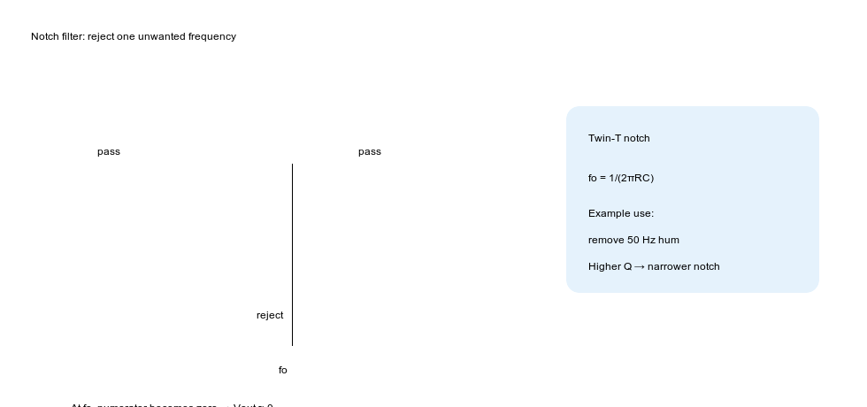

# Active Filters — Zero Level to Hero Level Study Guide

**Course area:** Analogue Electronics II / Operational Amplifiers  
**Topic:** Active filters, first-order filters, second-order filters, Sallen-Key filters, all-pass/phase-shifter filters, band-pass, band-reject and notch filters.

This file explains the three uploaded filter lecture PDFs in **exam-study style**: definitions first, then formulas, then derivations, then worked examples, then extra problems.

---

## How to use this guide

1. Read **Part A** first: it gives the basic language of filters.
2. Read **Part B** for first-order filter mathematics.
3. Read **Part C** for second-order filters and Q factor.
4. Read **Part D** for band-pass, band-reject, notch, all-pass and Sallen-Key.
5. Finally try the **5 extra practice problems** at the end.

---

# Part A — Foundation

## 1. What is a filter?

A **filter** is a circuit that allows some frequencies to pass and reduces or blocks other frequencies.

In real electronic systems, the wanted signal is often mixed with unwanted noise. Filters separate useful signals from unwanted frequencies.

Example:

- Audio signal contains useful voice frequencies.
- High-frequency noise may be mixed with it.
- A low-pass filter can reduce high-frequency noise.

So the simple meaning is:

```text
Filter = frequency selector
```

---

## 2. Passive filters vs active filters

### Passive filter

Uses only passive components:

```text
R, L, C
```

Example: RC low-pass filter.

### Active filter

Uses:

```text
op-amp + resistors + capacitors
```

Active filters do not usually need inductors.

## 2.1 Advantages of active filters

- No large inductors are needed.
- Can provide voltage gain.
- High input impedance.
- Low output impedance.
- Good isolation between stages.
- Compatible with integrated circuits.
- Can approximate ideal filter response closely.

## 2.2 Disadvantages of active filters

- Need power supply for the op-amp.
- Op-amp bandwidth limits high-frequency operation.
- Stability problems can happen at high frequency.
- Many active filters are practically used below about 100 kHz, depending on op-amp.

---

## 3. The main filter types



## 3.1 Low-pass filter

Passes low frequencies and rejects high frequencies.

```text
low frequency  → pass
high frequency → reject
```

## 3.2 High-pass filter

Passes high frequencies and rejects low frequencies.

```text
low frequency  → reject
high frequency → pass
```

## 3.3 Band-pass filter

Passes only a middle range of frequencies.

```text
low frequency    → reject
middle frequency → pass
high frequency   → reject
```

## 3.4 Band-reject filter

Rejects a middle range of frequencies and passes low and high frequencies.

Also called:

```text
band-stop filter
band-elimination filter
```

## 3.5 Notch filter

A notch filter is a very narrow band-reject filter.

It rejects one specific frequency, for example:

```text
50 Hz power-line hum
```

## 3.6 All-pass filter

Passes all frequencies with constant amplitude but changes phase.

So:

```text
amplitude response = constant
phase response = variable
```

All-pass filters are used as phase shifters.

---

## 4. Important filter terms

## 4.1 Transfer function

A transfer function tells how output depends on input.

```text
T(jω) = Vout / Vin
```

It tells two things:

1. **Magnitude response** — how much the signal is amplified or attenuated.
2. **Phase response** — how much the signal phase changes.

For sinusoidal frequency analysis:

```text
ω = 2πf
j = √(-1)
```

If:

```text
T(jω) = 10
```

then output is 10 times input.

If:

```text
T(jω) = -10
```

then output is 10 times input and inverted by 180°.

---

## 4.2 Pass band

The range of frequencies that pass without excessive attenuation.

Example for low-pass:

```text
0 Hz to fc
```

---

## 4.3 Stop band

The range of frequencies that are strongly attenuated.

Example for low-pass:

```text
frequencies above fc
```

---

## 4.4 Cutoff frequency

Cutoff frequency is the boundary between pass band and stop band.

Symbol:

```text
fc
```

At cutoff frequency:

```text
|T| = 0.707 × maximum gain
```

Since:

```text
0.707 = 1/√2
```

In decibels this is:

```text
-3 dB
```

So cutoff frequency is also called the:

```text
-3 dB frequency
```

---

## 4.5 Ripple

In practical filters, gain in pass band may not be perfectly flat. The variation is called ripple.

```text
ripple = maximum pass-band gain − minimum pass-band gain
```

Usually ripple is small, for example less than 1 dB.

---

## 4.6 Transition band

Ideal filters suddenly change from pass to reject. Practical filters do not.

The frequency region between pass band and stop band is called transition band.

---

## 4.7 Filter order

Filter order tells how fast the filter attenuates unwanted frequencies.

First-order filter:

```text
roll-off = 20 dB/decade
```

Second-order filter:

```text
roll-off = 40 dB/decade
```

Higher order means sharper cutoff.

---

## 5. Capacitor behavior — the heart of filters


Capacitor impedance is:

```text
ZC = 1/(jωC)
```

Since:

```text
ω = 2πf
```

we can write:

```text
ZC = 1/(j2πfC)
```

## 5.1 At low frequency

If frequency is low:

```text
f is small
```

then:

```text
ZC is large
```

So the capacitor behaves almost like an open circuit.

## 5.2 At high frequency

If frequency is high:

```text
f is large
```

then:

```text
ZC is small
```

So the capacitor behaves almost like a short circuit.

This one idea explains most RC filters.

---

# Part B — First-Order Active Filters

## 6. First-order low-pass filter

A first-order low-pass filter has this standard transfer function:

```text
T(jω) = To / (1 + jωRC)
```

where:

```text
To = pass-band gain
R, C = frequency-setting components
```

Cutoff frequency:

```text
fc = 1/(2πRC)
```

Because:

```text
ωc = 1/RC
fc = ωc/(2π)
```

Using frequency ratio:

```text
f/fc
```

we write:

```text
T(jf) = To / [1 + j(f/fc)]
```

---

## 6.1 Low-pass magnitude derivation

Start from:

```text
T(jf) = To / [1 + j(f/fc)]
```

Magnitude of denominator:

```text
|1 + jx| = √(1² + x²)
```

where:

```text
x = f/fc
```

Therefore:

```text
|T(jf)| = |To| / √[1 + (f/fc)²]
```

This is the main first-order low-pass magnitude formula.

---

## 6.2 Low frequency behavior

If:

```text
f << fc
```

then:

```text
f/fc ≈ 0
```

So:

```text
|T| ≈ |To|/√(1+0)
```

```text
|T| ≈ |To|
```

So low frequencies pass.

---

## 6.3 At cutoff frequency

At:

```text
f = fc
```

```text
f/fc = 1
```

So:

```text
|T| = |To|/√(1+1²)
```

```text
|T| = |To|/√2
```

```text
|T| = 0.707|To|
```

This is the -3 dB point.

---

## 6.4 High frequency behavior

If:

```text
f >> fc
```

then:

```text
f/fc is very large
```

So denominator becomes large and output becomes small.

Therefore high frequencies are attenuated.

---

## 7. Active low-pass using practical integrator



Your slides show a practical integrator used as a low-pass filter.

For an inverting op-amp:

```text
T(jω) = -Zf/Zin
```

For practical integrator low-pass:

```text
Zin = R1
```

Feedback network is:

```text
Rf || C
```

The impedance of `Rf || C` is:

```text
Zf = Rf / (1 + jωRfC)
```

So:

```text
T(jω) = - [Rf/(1+jωRfC)] / R1
```

Therefore:

```text
T(jω) = -(Rf/R1)/(1+jωRfC)
```

Define:

```text
To = -Rf/R1
```

and:

```text
fc = 1/(2πRfC)
```

Then:

```text
T(jf) = To / [1 + j(f/fc)]
```

This is exactly first-order low-pass form.

---

## 7.1 Physical explanation

At low frequency:

- Capacitor impedance is high.
- Capacitor is almost open.
- Feedback is mainly through `Rf`.
- Circuit behaves like normal inverting amplifier.

So:

```text
T ≈ -Rf/R1
```

At high frequency:

- Capacitor impedance becomes low.
- Feedback becomes very strong.
- Gain decreases.

So high frequencies are attenuated.

---

## 8. First-order high-pass filter

A first-order high-pass filter has this standard transfer function:

```text
T(jf) = To [j(f/fc)] / [1 + j(f/fc)]
```

Magnitude:

```text
|T(jf)| = |To|(f/fc) / √[1 + (f/fc)²]
```

Cutoff frequency:

```text
fc = 1/(2πRC)
```



---

## 8.1 Low frequency behavior

If:

```text
f << fc
```

then:

```text
f/fc ≈ 0
```

So numerator becomes nearly zero:

```text
|T| ≈ 0
```

Low frequencies are blocked.

---

## 8.2 At cutoff frequency

At:

```text
f = fc
```

```text
|T| = |To|×1 / √(1+1²)
```

```text
|T| = 0.707|To|
```

Again cutoff is the -3 dB point.

---

## 8.3 High frequency behavior

If:

```text
f >> fc
```

then:

```text
f/fc is very large
```

Numerator and denominator are approximately equal in magnitude.

So:

```text
|T| ≈ |To|
```

High frequencies pass.

---

## 9. Active high-pass using practical differentiator

Your slides show a practical differentiator used as a high-pass filter.

Transfer function:

```text
T(jf) = -(Rf/R1) [j(f/fc)] / [1 + j(f/fc)]
```

where:

```text
To = -Rf/R1
```

and:

```text
fc = 1/(2πR1C)
```

At low frequency:

```text
T ≈ 0
```

At high frequency:

```text
T ≈ -Rf/R1
```

So it is a high-pass filter.

---

## 10. First-order band-pass filter

A band-pass filter passes a frequency range between two cutoff frequencies:

```text
f1 ≤ f ≤ f2
```

where:

```text
f1 = lower cutoff frequency
f2 = upper cutoff frequency
```

A simple band-pass filter can be formed by cascading:

```text
high-pass section + low-pass section
```



## 10.1 Behavior

If:

```text
f << f1
```

then high-pass section blocks the signal.

If:

```text
f1 ≤ f ≤ f2
```

then signal passes.

If:

```text
f >> f2
```

then low-pass section blocks the signal.

So only the middle band passes.

---

## 10.2 Band-pass transfer function idea

A simple first-order band-pass transfer function can be thought of as:

```text
T(jf) = To × [j(f/f1)/(1+j(f/f1))] × [1/(1+j(f/f2))]
```

This means:

- first part is high-pass
- second part is low-pass
- together they make band-pass

---

## 11. First-order band-reject filter

Band-reject does the opposite of band-pass.

It rejects frequencies between:

```text
f1 and f2
```

and passes frequencies below `f1` and above `f2`.

A band-reject filter can be formed using:

```text
low-pass path + high-pass path
```

Then outputs are added.

Low-pass path passes low frequencies.  
High-pass path passes high frequencies.  
Middle band is rejected.

---

# Part C — All-Pass Filters / Phase Shifters

## 12. What is an all-pass filter?

An all-pass filter passes all frequencies with the same amplitude.

So:

```text
|T(jω)| = 1
```

But the phase changes with frequency.

This is why it is used as a phase shifter.

---

## 13. Phase lag type all-pass filter

Transfer function:

```text
T(jω) = (1 - jωRC)/(1 + jωRC)
```

Using:

```text
fc = 1/(2πRC)
```

we can write:

```text
T(jf) = [1 - j(f/fc)]/[1 + j(f/fc)]
```

---

## 13.1 Magnitude proof

Magnitude of numerator:

```text
|1 - jx| = √(1² + x²)
```

Magnitude of denominator:

```text
|1 + jx| = √(1² + x²)
```

Therefore:

```text
|T| = √(1+x²)/√(1+x²)
```

```text
|T| = 1
```

So amplitude is constant.

---

## 13.2 Phase response

For numerator:

```text
angle(1 - jx) = -tan⁻¹(x)
```

For denominator:

```text
angle(1 + jx) = +tan⁻¹(x)
```

Transfer function phase:

```text
∠T = numerator angle − denominator angle
```

```text
∠T = -tan⁻¹(x) - tan⁻¹(x)
```

```text
∠T = -2tan⁻¹(x)
```

where:

```text
x = f/fc = ωRC
```

So:

```text
∠T = -2tan⁻¹(f/fc)
```

At `f = fc`:

```text
∠T = -2tan⁻¹(1)
```

```text
∠T = -2(45°)
```

```text
∠T = -90°
```

So at cutoff/reference frequency, phase shift is -90°.

---

## 14. Phase lead type all-pass filter

Transfer function:

```text
T(jω) = - (1 - jωRC)/(1 + jωRC)
```

Magnitude is still:

```text
|T| = 1
```

The extra negative sign adds 180° phase.

So phase:

```text
∠T = 180° - 2tan⁻¹(ωRC)
```

At:

```text
f = fc
```

```text
∠T = 180° - 2tan⁻¹(1)
```

```text
∠T = 180° - 90°
```

```text
∠T = +90°
```

So phase lead circuit gives +90° at `fc`.

---

# Part D — Second-Order Filters

## 15. Why second-order filters are important

Second-order filters are building blocks for more complex filters.

A first-order filter has roll-off:

```text
20 dB/decade
```

A second-order filter has roll-off:

```text
40 dB/decade
```

So second-order filters are sharper.



---

## 16. Standard second-order denominator

Most second-order filters have denominator:

```text
1 - (f/fc)² + j(1/Q)(f/fc)
```

where:

```text
fc = cutoff or natural frequency
Q = quality factor
```

Q controls how peaky or sharp the response is.

---

## 17. What is Q factor?

Q means quality factor or voltage magnification factor.

Simple meaning:

```text
Q = sharpness of response
```

High Q:

```text
sharp, narrow, more peaking
```

Low Q:

```text
smooth, wide, less peaking
```

For band-pass filters:

```text
Q = fo/BW
```

where:

```text
BW = fH - fL
fo = √(fL fH)
```

---

## 18. Butterworth response

Butterworth response is maximally flat.

For second-order Butterworth:

```text
Q = 1/√2 = 0.707
```

This gives no peaking and a smooth pass-band.

If:

```text
Q > 0.707
```

then peaking occurs near cutoff.

---

## 19. Second-order low-pass filter

Standard second-order low-pass response:

```text
T(jf) = Ao / [1 - (f/fc)² + j(1/Q)(f/fc)]
```

where:

```text
Ao = pass-band gain
fc = cutoff frequency
Q = quality factor
```

## 19.1 Low frequency

If:

```text
f << fc
```

then:

```text
f/fc ≈ 0
```

So denominator becomes:

```text
1
```

Therefore:

```text
T ≈ Ao
```

Low frequencies pass.

## 19.2 High frequency

If:

```text
f >> fc
```

then `(f/fc)²` becomes large, so output decreases strongly.

Second-order low-pass roll-off:

```text
-40 dB/decade
```

---

## 20. Sallen-Key low-pass filter

Sallen-Key is a common second-order active filter topology.



The op-amp provides gain:

```text
Ao = 1 + Rf/R1
```

The cutoff frequency for Sallen-Key low-pass:

```text
fc = 1/[2π√(R2R3C1C2)]
```

Quality factor:

```text
Q = √(R2R3C1C2) / [R2C1(1 - Ao) + C2(R2 + R3)]
```

For equal components:

```text
R2 = R3 = R
C1 = C2 = C
```

then:

```text
fc = 1/(2πRC)
```

and:

```text
Q = 1/(3 - Ao)
```

This is a very important exam formula.

---

## 20.1 Butterworth Sallen-Key design

For Butterworth:

```text
Q = 0.707
```

For equal-component Sallen-Key:

```text
Q = 1/(3 - Ao)
```

So:

```text
0.707 = 1/(3 - Ao)
```

Rearrange:

```text
3 - Ao = 1/0.707
```

```text
3 - Ao = 1.414
```

```text
Ao = 3 - 1.414
```

```text
Ao = 1.586
```

So equal-component Butterworth Sallen-Key requires:

```text
Ao ≈ 1.586
```

Since:

```text
Ao = 1 + Rf/R1
```

then:

```text
Rf/R1 = 0.586
```

---

## 21. Second-order high-pass filter

Standard form:

```text
T(jf) = -Ao(f/fc)² / [1 - (f/fc)² + j(1/Q)(f/fc)]
```

The numerator has:

```text
(f/fc)²
```

So at low frequency:

```text
f = 0 → numerator = 0
```

Therefore low frequency is rejected.

At high frequency, the circuit passes high frequencies.

For equal-component Sallen-Key high-pass:

```text
fc = 1/(2πRC)
```

```text
Q = 1/(3 - Ao)
```

---

## 22. Second-order band-pass filter

Standard form:

```text
T(jf) = [(1/Q)j(f/fo)] / [1 - (f/fo)² + (1/Q)j(f/fo)]
```

where:

```text
fo = center frequency
Q = quality factor
```

The band-pass filter has two cutoff frequencies:

```text
fL = lower -3 dB frequency
fH = upper -3 dB frequency
```

Bandwidth:

```text
BW = fH - fL
```

Center frequency:

```text
fo = √(fL fH)
```

Quality factor:

```text
Q = fo/BW
```

If:

```text
Q < 10
```

it is a wide band-pass filter.

If:

```text
Q > 10
```

it is a narrow band-pass filter.

---

## 23. Band-pass by cascading filters

A band-pass filter can be formed by cascading:

```text
second-order high-pass + second-order low-pass
```

The order does not matter:

```text
high-pass first then low-pass
```

or:

```text
low-pass first then high-pass
```

Both create a pass band between the low and high cutoff frequencies.

---

## 24. Second-order band-reject filter

Band-reject filter is the inverse of band-pass filter.

It passes low and high frequencies, but rejects the middle band.

Standard notch/band-reject form:

```text
T(jf) = [1 - (f/fo)²] / [1 - (f/fo)² + (1/Q)j(f/fo)]
```

At:

```text
f = fo
```

numerator becomes:

```text
1 - (fo/fo)² = 1 - 1 = 0
```

So:

```text
T = 0
```

Therefore output becomes zero at `fo`.

---

## 25. Notch filter / Twin-T network



A notch filter is a narrow band-reject filter.

Common use:

```text
remove 50 Hz mains hum
```

Twin-T notch filter uses two T-networks:

- one T-network made from resistors and capacitor
- another T-network made from capacitors and resistor

For the common Twin-T notch:

```text
fo = 1/(2πRC)
```

At `fo`, output is almost zero.

Higher Q means a narrower notch.

---

# Part E — How to Solve Exam Problems

## 26. Step-by-step method

## Step 1: Identify the filter type

Ask:

```text
Does it pass low frequencies?
Does it pass high frequencies?
Does it pass only middle?
Does it reject middle?
Does it pass all but change phase?
```

## Step 2: Write the correct standard formula

Low-pass:

```text
T = To/[1+j(f/fc)]
```

High-pass:

```text
T = To[j(f/fc)]/[1+j(f/fc)]
```

Second-order low-pass:

```text
T = Ao/[1-(f/fc)²+j(1/Q)(f/fc)]
```

Band-pass:

```text
BW = fH - fL
fo = √(fL fH)
Q = fo/BW
```

## Step 3: Find cutoff frequency

First-order:

```text
fc = 1/(2πRC)
```

Second-order equal-component Sallen-Key:

```text
fc = 1/(2πRC)
```

General Sallen-Key:

```text
fc = 1/[2π√(R2R3C1C2)]
```

## Step 4: Find gain

Inverting op-amp:

```text
To = -Rf/R1
```

Non-inverting op-amp:

```text
Ao = 1 + Rf/R1
```

## Step 5: Calculate output

```text
Vout = |T| × Vin
```

Remember: if gain is negative, output is inverted.

---

# Part F — Worked Examples

## Example 1 — First-order low-pass cutoff

Given:

```text
R = 10 kΩ
C = 0.01 μF
To = 5
Vin = 1 V
```

Find `fc` and output amplitude at cutoff.

Convert:

```text
R = 10,000 Ω
C = 0.01 μF = 10 nF = 10×10⁻⁹ F
```

Cutoff:

```text
fc = 1/(2πRC)
```

```text
fc = 1/[2π(10,000)(10×10⁻⁹)]
```

```text
fc ≈ 1591 Hz
```

At cutoff:

```text
|T| = 0.707To
```

```text
|T| = 0.707 × 5 = 3.535
```

Output:

```text
Vout = |T|Vin
```

```text
Vout = 3.535 × 1
```

```text
Vout = 3.535 V
```

---

## Example 2 — First-order high-pass output

Given:

```text
R = 1 kΩ
C = 0.1 μF
To = 10
f = 159.1 Hz
Vin = 2 V
```

First find cutoff:

```text
fc = 1/[2π(1000)(0.1×10⁻⁶)]
```

```text
fc ≈ 1591 Hz
```

So:

```text
f/fc = 159.1/1591 = 0.1
```

High-pass magnitude:

```text
|T| = To(f/fc)/√[1+(f/fc)²]
```

```text
|T| = 10(0.1)/√(1+0.1²)
```

```text
|T| = 1/√1.01
```

```text
|T| ≈ 0.995
```

Output:

```text
Vout = 0.995 × 2
```

```text
Vout ≈ 1.99 V
```

This is much smaller than pass-band output because frequency is below cutoff.

---

## Example 3 — Sallen-Key Butterworth gain

For equal-component Sallen-Key low-pass, find `Ao` for Butterworth response.

Formula:

```text
Q = 1/(3 - Ao)
```

Butterworth:

```text
Q = 0.707
```

So:

```text
0.707 = 1/(3 - Ao)
```

```text
3 - Ao = 1/0.707 = 1.414
```

```text
Ao = 3 - 1.414 = 1.586
```

Answer:

```text
Ao ≈ 1.586
```

---

## Example 4 — Band-pass Q

Given:

```text
fL = 900 Hz
fH = 1100 Hz
```

Find bandwidth:

```text
BW = fH - fL
```

```text
BW = 1100 - 900 = 200 Hz
```

Find center frequency:

```text
fo = √(fL fH)
```

```text
fo = √(900×1100)
```

```text
fo ≈ 995 Hz
```

Find Q:

```text
Q = fo/BW
```

```text
Q = 995/200
```

```text
Q ≈ 4.98
```

Since `Q < 10`, this is a wide band-pass filter.

---

## Example 5 — All-pass phase shift

Given:

```text
R = 10 kΩ
C = 0.01 μF
```

Find phase lag at `f = fc`.

First:

```text
fc = 1/(2πRC)
```

```text
fc = 1/[2π(10,000)(10×10⁻⁹)]
```

```text
fc ≈ 1591 Hz
```

Phase lag formula:

```text
∠T = -2tan⁻¹(f/fc)
```

At `f = fc`:

```text
f/fc = 1
```

```text
∠T = -2tan⁻¹(1)
```

```text
tan⁻¹(1) = 45°
```

```text
∠T = -90°
```

---

# Part G — Extra 5 Practice Problems

Try first, then check the solutions.

---

## Problem 1 — Low-pass design

Design a first-order low-pass filter with:

```text
fc = 2 kHz
C = 0.01 μF
```

Find `R`.

### Solution

```text
fc = 1/(2πRC)
```

Rearrange:

```text
R = 1/(2πfcC)
```

```text
C = 0.01 μF = 10×10⁻⁹ F
```

```text
R = 1/[2π(2000)(10×10⁻⁹)]
```

```text
R ≈ 7958 Ω
```

Answer:

```text
R ≈ 7.96 kΩ
```

Use standard value:

```text
R ≈ 8.2 kΩ
```

---

## Problem 2 — High-pass magnitude

A high-pass filter has:

```text
fc = 1 kHz
To = 6
Vin = 0.5 V
f = 10 kHz
```

Find approximate output amplitude.

### Solution

```text
f/fc = 10k/1k = 10
```

High-pass magnitude:

```text
|T| = To(f/fc)/√[1+(f/fc)²]
```

```text
|T| = 6(10)/√(1+10²)
```

```text
|T| = 60/√101
```

```text
|T| ≈ 60/10.05
```

```text
|T| ≈ 5.97
```

Output:

```text
Vout = 5.97 × 0.5
```

```text
Vout ≈ 2.99 V
```

Since frequency is much higher than cutoff, gain is almost `To = 6`.

---

## Problem 3 — Active low-pass gain and cutoff

An active inverting low-pass filter has:

```text
Rf = 100 kΩ
R1 = 20 kΩ
C = 0.01 μF
```

Find:

1. pass-band gain
2. cutoff frequency

### Solution

Pass-band gain:

```text
To = -Rf/R1
```

```text
To = -100k/20k
```

```text
To = -5
```

Magnitude:

```text
|To| = 5
```

Cutoff:

```text
fc = 1/(2πRfC)
```

```text
fc = 1/[2π(100,000)(10×10⁻⁹)]
```

```text
fc ≈ 159 Hz
```

Answer:

```text
pass-band gain = -5
fc ≈ 159 Hz
```

---

## Problem 4 — Band-pass center frequency and Q

A band-pass filter has:

```text
fL = 2 kHz
fH = 8 kHz
```

Find:

1. `BW`
2. `fo`
3. `Q`
4. wide or narrow?

### Solution

Bandwidth:

```text
BW = fH - fL
```

```text
BW = 8k - 2k = 6 kHz
```

Center frequency:

```text
fo = √(fL fH)
```

```text
fo = √(2000×8000)
```

```text
fo = √16,000,000
```

```text
fo = 4000 Hz
```

Quality factor:

```text
Q = fo/BW
```

```text
Q = 4000/6000
```

```text
Q = 0.667
```

Since:

```text
Q < 10
```

it is wide band-pass.

---

## Problem 5 — Notch filter component value

A Twin-T notch filter must reject:

```text
fo = 50 Hz
```

If:

```text
C = 0.1 μF
```

find `R`.

### Solution

Formula:

```text
fo = 1/(2πRC)
```

Rearrange:

```text
R = 1/(2πfoC)
```

```text
C = 0.1 μF = 0.1×10⁻⁶ F
```

```text
R = 1/[2π(50)(0.1×10⁻⁶)]
```

```text
R ≈ 31,831 Ω
```

Answer:

```text
R ≈ 31.8 kΩ
```

Use standard value near:

```text
R ≈ 33 kΩ
```

---

# Final Exam Formula Sheet

## Capacitor impedance

```text
ZC = 1/(jωC)
```

## Angular frequency

```text
ω = 2πf
```

## Transfer function

```text
T(jω) = Vout/Vin
```

## First-order cutoff

```text
fc = 1/(2πRC)
```

## Low-pass

```text
T(jf) = To/[1+j(f/fc)]
```

```text
|T| = |To|/√[1+(f/fc)²]
```

## High-pass

```text
T(jf) = To[j(f/fc)]/[1+j(f/fc)]
```

```text
|T| = |To|(f/fc)/√[1+(f/fc)²]
```

## Active inverting low-pass

```text
T(jω) = -(Rf/R1)/(1+jωRfC)
```

```text
fc = 1/(2πRfC)
```

## Active high-pass practical differentiator

```text
T(jf) = -(Rf/R1)[j(f/fc)]/[1+j(f/fc)]
```

```text
fc = 1/(2πR1C)
```

## Band-pass

```text
BW = fH - fL
```

```text
fo = √(fL fH)
```

```text
Q = fo/BW
```

## Second-order low-pass

```text
T(jf) = Ao/[1-(f/fc)²+j(1/Q)(f/fc)]
```

## Second-order high-pass

```text
T(jf) = -Ao(f/fc)²/[1-(f/fc)²+j(1/Q)(f/fc)]
```

## Sallen-Key equal components

```text
fc = 1/(2πRC)
```

```text
Q = 1/(3 - Ao)
```

```text
Ao = 1 + Rf/R1
```

## Butterworth

```text
Q = 0.707
```

## All-pass phase lag

```text
T(jω) = (1-jωRC)/(1+jωRC)
```

```text
∠T = -2tan⁻¹(ωRC)
```

## All-pass phase lead

```text
T(jω) = -(1-jωRC)/(1+jωRC)
```

```text
∠T = 180° - 2tan⁻¹(ωRC)
```

## Notch filter

```text
fo = 1/(2πRC)
```

At `f = fo`:

```text
T = 0
```

---

# Final study advice

If the exam gives you a filter circuit, first identify the capacitor position.

Remember:

```text
capacitor to ground after resistor → low-pass
capacitor in series before resistor → high-pass
high-pass + low-pass → band-pass
low-pass + high-pass in parallel → band-reject
all-pass → amplitude constant, phase changes
```

Then use:

```text
fc = 1/(2πRC)
```

and choose the correct transfer function.
