# Analogue Electronics II — Operational Amplifiers

**Step-by-step study guide from your lecture slides**  
Course: **BECS 21413 — Analogue Electronics II**  
Topic: **Operational Amplifiers (Op-amps)**

> Goal: Learn the op-amp ideas slowly, in simple language, with formulas and example steps.

---

## How to study this file

1. First understand the **ideal op-amp rules**.
2. Then learn the basic amplifier circuits: **inverting**, **non-inverting**, and **voltage follower**.
3. Then move to applications: **summing**, **averaging**, **scaling adder**, **difference amplifier**, **integrator**, **differentiator**, and **phase shifter**.
4. Finally revise practical limitations: **CMRR**, **offset**, **bias current**, **slew rate**, **bandwidth**, and **single-supply operation**.

---

# 1. What is an operational amplifier?

An **operational amplifier**, usually called an **op-amp**, is a high-gain voltage amplifier. It was originally used to perform mathematical operations such as:

- addition
- subtraction
- integration
- differentiation

Today, op-amps are common analogue building blocks used in:

- instrumentation
- signal conditioning
- computation
- control systems
- filters
- power supplies
- waveform generators

Common op-amp ICs include **LM741, LM324, LM358, RC4558, NE5532, TL072, OPA2134, LM339, OP07, LMH6629**.

---

# 2. Op-amp symbol and terminals

An op-amp normally has at least **five terminals**:

1. **Inverting input**: marked `−`
2. **Non-inverting input**: marked `+`
3. **Output**
4. **Positive supply**: `+VCC`
5. **Negative supply**: `−VCC`

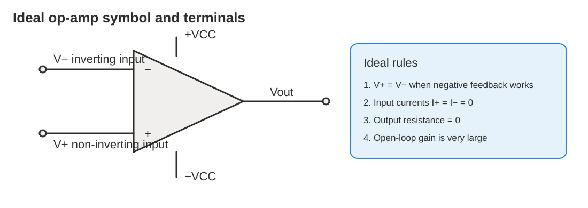

## Easy meaning of the two inputs

- If signal goes into the **non-inverting input** `+`, output has the **same phase**.
- If signal goes into the **inverting input** `−`, output is **inverted** by 180°.

---

# 3. Ideal op-amp assumptions

The ideal op-amp is not real, but it makes circuit analysis easy.

## Ideal characteristics

| Property | Ideal value | Meaning |
|---|---:|---|
| Open-loop voltage gain | Infinite | Even tiny input difference can create output |
| Bandwidth | Infinite | Works at all frequencies |
| Input impedance | Infinite | No current enters inputs |
| Output impedance | Zero | Output acts like an ideal voltage source |
| Input current | Zero | `I+ = I− = 0` |

## Two golden rules of ideal op-amps

When the op-amp has **negative feedback** and is operating linearly:

### Rule 1: Input voltage difference is zero

```text
V+ − V− = 0
V+ = V−
```

This does **not** mean the two inputs are physically connected. It means they are at almost the same voltage due to feedback. This is called a **virtual short**.

### Rule 2: Input currents are zero

```text
I+ = I− = 0
```

No current enters the input terminals in the ideal model.

---

# 4. Feedback: open-loop and closed-loop

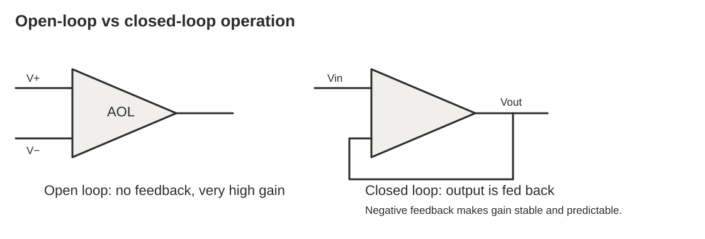

## Open-loop mode

No feedback is used.

```text
Vo = AOL × Vi
```

where `AOL` is the open-loop gain.

Since ideal `AOL → ∞`, a very small input difference can saturate the output.

## Closed-loop mode

The output is connected back to one input directly or indirectly. This is called **feedback**.

In most amplifier circuits, we use **negative feedback** because it:

- stabilizes gain
- improves frequency response
- reduces distortion
- makes output predictable

---

# 5. Practical op-amps are not ideal

Real op-amps are close to ideal, but not perfect.

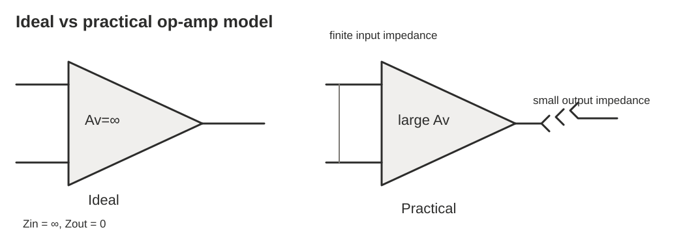

| Property | Ideal | Practical typical |
|---|---:|---:|
| Open-loop gain | Infinite | Very high, e.g. ≥ 10⁴ |
| Open-loop bandwidth | Infinite | Limited, often dominant pole near low frequency |
| CMRR | Infinite | High, e.g. ≥ 70 dB |
| Input impedance | Infinite | High, e.g. ≥ 10 MΩ |
| Output impedance | Zero | Low, e.g. < 500 Ω |
| Input current | Zero | Small, e.g. < 0.5 μA |
| Offset voltage/current | Zero | Small but not zero |

---

# 6. Internal block diagram of an op-amp

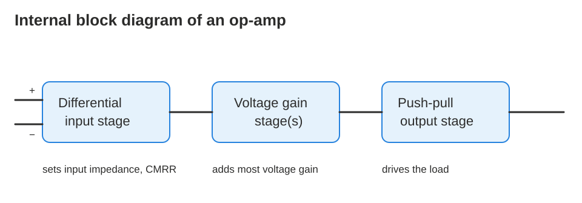

An op-amp has three main internal stages:

## 6.1 Differential input stage

- First stage of the op-amp.
- Amplifies the difference between the two inputs.
- Determines many important properties:
  - gain
  - CMRR
  - input impedance

## 6.2 Voltage gain stage

- Usually a Class A amplifier stage.
- Provides most of the voltage gain.
- Some op-amps have more than one gain stage.

## 6.3 Output stage

- Often a push-pull Class B output stage.
- Provides current to drive the load.

---

# 7. Op-amp input modes

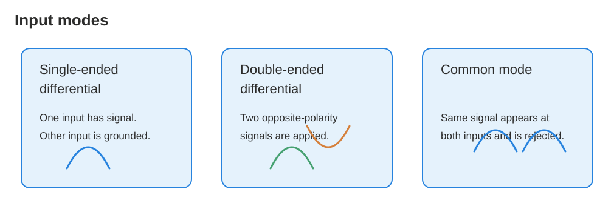

## 7.1 Single-ended differential mode

One input has the signal and the other input is grounded.

- Signal to `−` input → output is inverted.
- Signal to `+` input → output is not inverted.

## 7.2 Double-ended differential mode

Two opposite-polarity signals are applied to the two inputs.

The op-amp amplifies the **difference** between them.

## 7.3 Common mode

The same signal appears on both inputs.

Ideally, the op-amp rejects this signal and output becomes zero. This is called **common-mode rejection**.

---

# 8. Important op-amp parameters

## 8.1 Common-Mode Rejection Ratio (CMRR)

CMRR measures how well an op-amp rejects unwanted signals that appear equally on both inputs.

```text
CMRR = Aol / Acm
```

where:

- `Aol` = differential open-loop gain
- `Acm` = common-mode gain

In decibels:

```text
CMRR(dB) = 20 log10(Aol / Acm)
```

### Example

Given:

```text
Aol = 100,000
Acm = 0.2
```

Step 1:

```text
CMRR = 100,000 / 0.2 = 500,000
```

Step 2:

```text
CMRR(dB) = 20 log10(500,000)
CMRR(dB) ≈ 114 dB
```

---

## 8.2 Maximum output voltage swing

Ideally, if supply voltage is `±VCC`, output could swing to `+VCC` and `−VCC`.

Practically, output cannot reach the exact supply rails.

Example for 741 with `VCC = ±15 V`:

- with `RL = 2 kΩ`, output may swing about `±13 V`
- with `RL = 10 kΩ`, output may swing about `±14 V`

Larger load resistance usually gives larger output swing.

---

## 8.3 Input offset voltage

An ideal op-amp gives `0 V` output when input difference is zero.

A practical op-amp may give a small unwanted output due to internal transistor mismatch.

The **input offset voltage** `Vos` is the small differential input voltage required to force output to zero.

---

## 8.4 Input offset voltage drift

Offset voltage changes with temperature.

The change per degree Celsius is called **offset voltage drift**.

---

## 8.5 Input bias current

Real op-amp inputs need a very small DC current.

```text
IBIAS = (I1 + I2) / 2
```

where `I1` and `I2` are the input currents.

---

## 8.6 Input impedance

Two types are important:

1. **Differential input impedance**: between `+` and `−` inputs.
2. **Common-mode input impedance**: between each input and ground.

Higher input impedance is usually better because the op-amp does not load the source much.

---

## 8.7 Input offset current

Ideally both input bias currents are equal.

Practically they are slightly different.

```text
IOS = |I1 − I2|
```

---

## 8.8 Output impedance

Output impedance is the resistance seen looking into the output terminal.

Ideal value is zero. Practical value is low but not zero.

---

## 8.9 Slew rate

Slew rate is the maximum speed at which output voltage can change.

```text
Slew rate = ΔVout / Δt
```

Unit:

```text
V/μs
```

### Example

If output changes from `−9 V` to `+9 V` in `1 μs`:

```text
ΔVout = +9 − (−9) = 18 V
Slew rate = 18 V / 1 μs = 18 V/μs
```

---

## 8.10 Frequency response

At low frequency, op-amp open-loop gain is very high. As frequency increases, gain decreases.

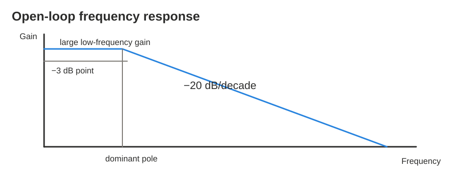

Typical slope after the dominant pole:

```text
−20 dB/decade
```

This means gain reduces by 20 dB when frequency increases by 10 times.

---

# 9. Negative feedback

Negative feedback takes part of the output and feeds it back out of phase with the input.

Benefits:

- closed-loop gain becomes stable
- gain depends mainly on external resistors
- bandwidth improves
- distortion reduces

This is why most practical op-amp amplifier circuits use negative feedback.

---

# 10. Inverting amplifier

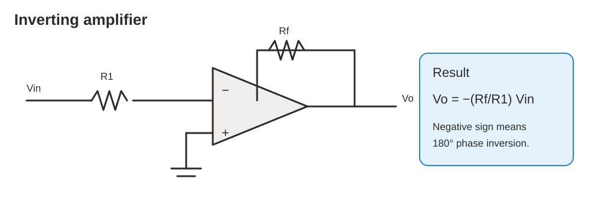

## Circuit idea

- Input is applied through `R1` to the inverting input.
- Non-inverting input is grounded.
- Feedback resistor `Rf` connects output to inverting input.

## Step-by-step derivation

Because the `+` input is grounded:

```text
V+ = 0 V
```

Using ideal op-amp rule:

```text
V− = V+ = 0 V
```

So the inverting input is at **virtual ground**.

Current through `R1`:

```text
I1 = Vin / R1
```

No current enters op-amp input, so the same current flows through `Rf`:

```text
I1 = If
```

Output voltage:

```text
Vo = −If Rf
```

Substitute `If = Vin/R1`:

```text
Vo = −(Rf/R1) Vin
```

## Voltage gain

```text
Av = Vo/Vin = −Rf/R1
```

## Special case

If:

```text
Rf = R1
```

then:

```text
Vo = −Vin
```

The circuit becomes a unity-gain inverter.

---

# 11. Non-inverting amplifier

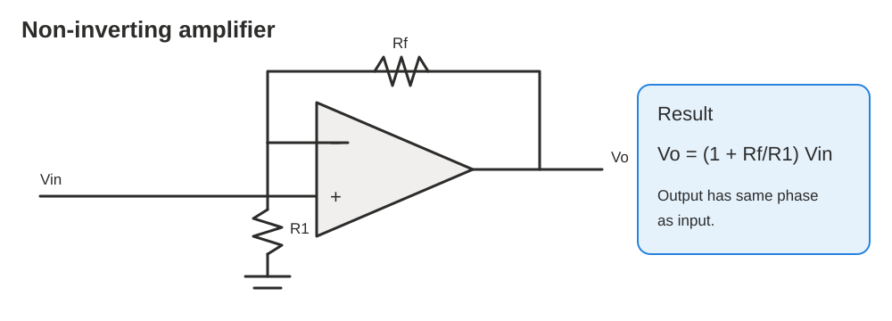

## Circuit idea

- Input is applied to the non-inverting input.
- Output is fed back through a resistor divider.

## Formula

```text
Vo = (1 + Rf/R1) Vin
```

## Voltage gain

```text
Av = 1 + Rf/R1
```

Important point: output has the **same phase** as input.

### Example

If:

```text
Rf = 100 kΩ
R1 = 4.7 kΩ
```

then:

```text
Av = 1 + 100/4.7
Av ≈ 22.3
```

---

# 12. Voltage follower

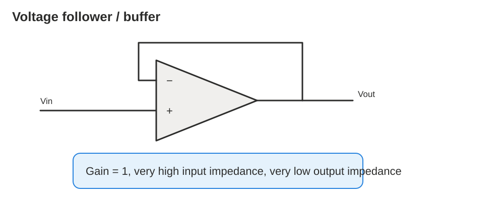

The voltage follower is a special non-inverting amplifier.

Here, output is directly connected to the inverting input.

```text
Av = 1
Vo = Vin
```

## Why is it useful?

It has:

- very high input impedance
- very low output impedance

So it works as a **buffer** between:

- high-impedance signal source
- low-impedance load

---

# 13. AC amplifiers

Inverting and non-inverting amplifiers can amplify AC signals.

But if the input has unwanted DC level, we use a **coupling capacitor** `Cs`.

The coupling capacitor:

- blocks DC
- passes AC
- sets low-frequency cut-off

Low-frequency cut-off:

```text
fL = 1 / [2π Cs (Rif + Rs)]
```

where:

- `Rif` = AC input resistance of gain stage
- `Rs` = source resistance

Closed-loop gain formulas remain:

```text
AC inverting amplifier:      Av = −Rf/Ri
AC non-inverting amplifier:  Av = 1 + Rf/Ri
```

High-frequency cut-off depends on closed-loop gain and op-amp bandwidth.

---

# 14. Summing amplifier

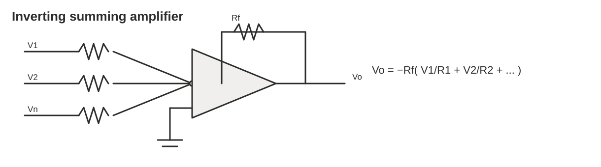

A summing amplifier adds two or more input voltages.

It is based on the inverting amplifier.

## General formula

```text
Vo = −Rf (V1/R1 + V2/R2 + V3/R3 + ... + Vn/Rn)
```

## If all input resistors are equal

If:

```text
R1 = R2 = R3 = ... = Rn = R
```

then:

```text
Vo = −(Rf/R)(V1 + V2 + V3 + ... + Vn)
```

## Unity-gain summing amplifier

If:

```text
Rf = R
```

then:

```text
Vo = −(V1 + V2 + V3 + ... + Vn)
```

### Example 1

Given:

```text
V1 = 3 V
V2 = 1 V
V3 = 8 V
Rf = R1 = R2 = R3
```

Then:

```text
Vo = −(3 + 1 + 8)
Vo = −12 V
```

### Example 2

Given:

```text
V1 = 0.2 V
V2 = 0.5 V
Rf = 10 kΩ
R1 = R2 = 1 kΩ
```

Step 1:

```text
Rf/R = 10 kΩ / 1 kΩ = 10
```

Step 2:

```text
Vo = −10(0.2 + 0.5)
Vo = −10(0.7)
Vo = −7 V
```

---

# 15. Averaging amplifier

A summing amplifier can produce the average of input voltages.

For `n` equal input resistors, choose:

```text
Rf/R = 1/n
```

Then:

```text
Vo = −(1/n)(V1 + V2 + ... + Vn)
```

The magnitude of output equals the average. The sign is negative because the circuit is inverting.

### Example

Inputs:

```text
V1 = 1 V
V2 = 2 V
V3 = 3 V
V4 = 4 V
```

Average:

```text
Average = (1 + 2 + 3 + 4) / 4
Average = 10/4
Average = 2.5 V
```

If the circuit is inverting:

```text
Vo = −2.5 V
```

---

# 16. Scaling adder

A scaling adder gives different weights to different input voltages.

This is done by changing input resistor values.

```text
Vo = −[(Rf/R1)V1 + (Rf/R2)V2 + (Rf/R3)V3 + ...]
```

The weight of each input is:

```text
weight = Rf/Rinput
```

### Example

Given:

```text
V1 = 3 V, R1 = 47 kΩ
V2 = 2 V, R2 = 100 kΩ
V3 = 8 V, R3 = 10 kΩ
Rf = 10 kΩ
```

Weights:

```text
weight1 = 10/47 = 0.213
weight2 = 10/100 = 0.100
weight3 = 10/10 = 1.00
```

Output:

```text
Vo = −[0.213(3) + 0.100(2) + 1.00(8)]
Vo = −[0.639 + 0.2 + 8]
Vo = −8.839 V
Vo ≈ −8.84 V
```

---

# 17. Non-inverting summing case

In the non-inverting summing circuit, inputs are combined at the `+` input side.

For equal input resistors and proper feedback selection, output can become:

```text
Vo = V1 + V2 + V3 + ... + Vn
```

Important idea:

- Inverting summing amplifier gives negative sum.
- Non-inverting summing amplifier can give positive sum.

---

# 18. Difference amplifier

A difference amplifier subtracts one input voltage from another.

For matched resistor ratios:

```text
Vo = (R2/R1)(V2 − V1)
```

## Step-by-step idea using superposition

1. Consider output due to `V1` alone.

```text
Vout1 = −(R2/R1)V1
```

2. Consider output due to `V2` alone.

```text
Vout2 = +(R2/R1)V2
```

3. Add both contributions.

```text
Vo = Vout1 + Vout2
Vo = −(R2/R1)V1 + (R2/R1)V2
Vo = (R2/R1)(V2 − V1)
```

---

# 19. Integrator

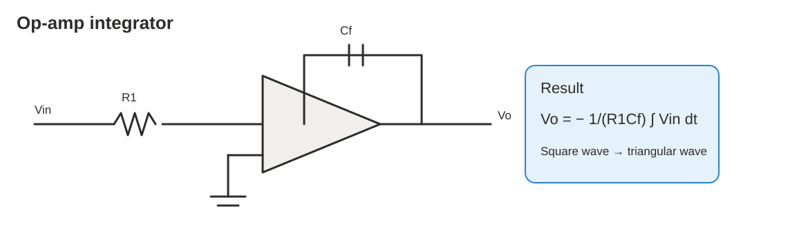

An integrator produces an output proportional to the integral of the input.

## Formula

```text
Vo = − 1/(R1 Cf) ∫ Vin dt
```

## Meaning

The output depends on the **area under the input waveform**.

## Waveform examples

| Input | Output of integrator |
|---|---|
| sine wave | cosine wave with phase/sign change |
| square wave | triangular wave |
| constant DC | ramp increasing/decreasing until saturation |

## True integrator transfer function

Feedback impedance:

```text
Zf = 1/(jωCf)
```

Input impedance:

```text
Zi = R1
```

Transfer function:

```text
T(jω) = −Zf/Zi
T(jω) = −1/(jωR1Cf)
```

Magnitude:

```text
|T(jω)| = 1/(ωR1Cf)
```

At DC:

```text
ω = 0 → |T(jω)| → ∞
```

So a true integrator can saturate because DC gain is extremely high.

---

# 20. Practical / AC integrator

A practical integrator adds a large resistor `Rf` in parallel with the feedback capacitor.

Why?

- The capacitor alone is open at DC.
- DC offset errors can make output ramp into saturation.
- `Rf` gives a DC feedback path and limits DC gain.

A bias-current compensating resistor may be added:

```text
Rm = R1 || Rf
```

## Practical integrator cut-off frequency

```text
fo = 1/(2πRfCf)
```

For frequencies much higher than `fo`, it behaves like a true integrator.

---

# 21. Differentiator

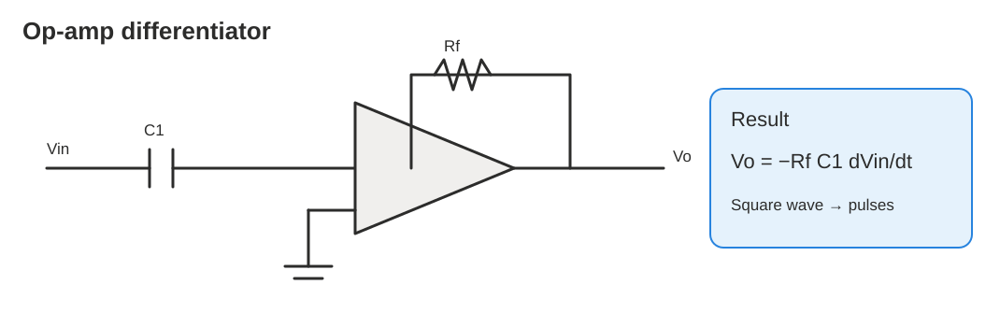

A differentiator produces an output proportional to the derivative of the input.

## Formula

```text
Vo = −Rf C1 dVin/dt
```

## Waveform examples

| Input | Output of differentiator |
|---|---|
| cosine wave | sine wave with phase/sign change |
| triangular wave | square wave |
| square wave | sharp pulses at rising/falling edges |

## Problem with ideal differentiator

The gain increases with frequency:

```text
gain ∝ Rf/Xc
```

At high frequency, capacitor reactance `Xc` becomes small. Therefore high-frequency noise is amplified strongly.

So ideal differentiators can be unstable and noisy.

---

# 22. Practical differentiator

A practical differentiator adds a resistor in series with the input capacitor.

Transfer function:

```text
T(jω) = − jωRfC1 / (1 + jωR1C1)
```

Magnitude:

```text
|T(jω)| = (ωRfC1) / sqrt[1 + (ωR1C1)^2]
```

Cut-off frequency:

```text
fo = 1/(2πR1C1)
```

At low frequency:

```text
T(jω) ≈ −jωRfC1
```

At high frequency:

```text
T(jω) ≈ −Rf/R1
```

So practical differentiator limits high-frequency gain.

---

# 23. Phase shifters

A phase shifter changes the phase of a signal while keeping amplitude nearly constant.

A signal can:

- **lead** another signal: positive phase shift
- **lag** another signal: negative phase shift

Example:

- If `VA` is reference and `VB` is +90°, then `VB` leads `VA` by 90°.
- If `VB` is reference and `VA` is −90°, then `VA` lags `VB` by 90°.

---

# 24. Phase lag type phase shifter

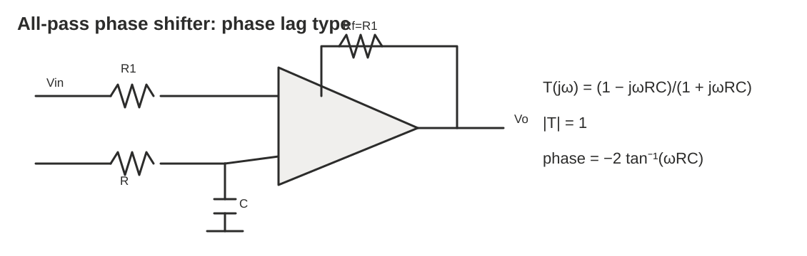

For the phase lag type:

```text
T(jω) = (1 − jωRC)/(1 + jωRC)
```

Magnitude:

```text
|T(jω)| = 1
```

So amplitude stays constant.

Phase response:

```text
∠T(jω) = −2 tan⁻¹(ωRC)
```

Cut-off / reference frequency:

```text
fc = 1/(2πRC)
```

At `f = fc`:

```text
phase shift = −90°
```

The phase shift varies from:

```text
0° to −180°
```

By changing `R` or `C`, you can adjust the phase shift.

---

# 25. Phase lead type phase shifter

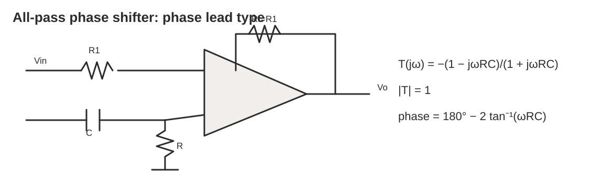

The phase lead circuit is obtained by interchanging `R` and `C` in the phase-lag circuit.

Transfer function:

```text
T(jω) = −(1 − jωRC)/(1 + jωRC)
```

Magnitude:

```text
|T(jω)| = 1
```

Phase response:

```text
∠T(jω) = 180° − 2 tan⁻¹(ωRC)
```

The phase shift varies from:

```text
0° to +180°
```

By changing `R` or `C`, you can adjust the phase shift.

---

# 26. Op-amp using single power supply

Most op-amp circuits are shown with two supplies, for example:

```text
+15 V and −15 V
```

The midpoint is ground.

But sometimes we use only one supply, such as:

```text
0 V and +V_B
```

Then we need to create a midpoint reference:

```text
VB/2
```

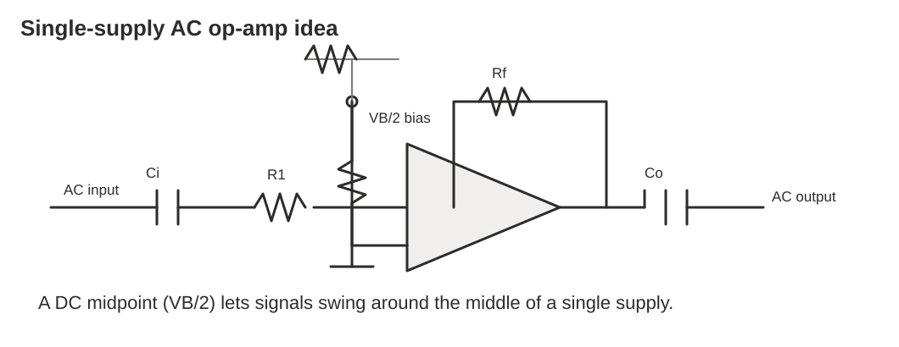

## Single-supply AC inverting amplifier

A voltage divider creates `VB/2` at the non-inverting input.

The op-amp output DC level also becomes approximately:

```text
VB/2
```

Input capacitor `Ci` blocks input DC. Output capacitor `Co` blocks output DC so the load receives only AC.

AC gain:

```text
Av = −Rf/R1
```

At DC:

```text
Av = 0
```

because capacitors block DC.

## Single-supply AC non-inverting amplifier

Again, the circuit uses a `VB/2` DC bias level.

AC gain:

```text
Av = 1 + Rf/R1
```

---

# 27. Quick formula sheet

| Circuit / parameter | Formula |
|---|---|
| Ideal op-amp rule 1 | `V+ = V−` |
| Ideal op-amp rule 2 | `I+ = I− = 0` |
| Inverting amplifier | `Vo = −(Rf/R1)Vin` |
| Non-inverting amplifier | `Vo = (1 + Rf/R1)Vin` |
| Voltage follower | `Vo = Vin` |
| Summing amplifier | `Vo = −Rf(V1/R1 + V2/R2 + ... + Vn/Rn)` |
| Equal-resistor summer | `Vo = −(Rf/R)(V1 + V2 + ... + Vn)` |
| Averaging amplifier | `Vo = −(1/n)(V1 + V2 + ... + Vn)` |
| Scaling adder | `Vo = −[(Rf/R1)V1 + (Rf/R2)V2 + ...]` |
| Difference amplifier | `Vo = (R2/R1)(V2 − V1)` |
| Integrator | `Vo = −1/(R1Cf) ∫ Vin dt` |
| True integrator transfer | `T(jω) = −1/(jωR1Cf)` |
| Practical integrator cut-off | `fo = 1/(2πRfCf)` |
| Differentiator | `Vo = −RfC1(dVin/dt)` |
| Practical differentiator transfer | `T(jω)=−jωRfC1/(1+jωR1C1)` |
| Practical differentiator cut-off | `fo = 1/(2πR1C1)` |
| Phase lag shifter | `T(jω)=(1−jωRC)/(1+jωRC)` |
| Phase lag angle | `−2tan⁻¹(ωRC)` |
| Phase lead angle | `180°−2tan⁻¹(ωRC)` |
| CMRR | `Aol/Acm` |
| CMRR in dB | `20log10(Aol/Acm)` |
| Slew rate | `ΔVout/Δt` |
| AC low cut-off | `fL = 1/[2πCs(Rif+Rs)]` |

---

# 28. Study checklist

Use this checklist before an exam or tutorial.

- [ ] I can state the two ideal op-amp rules.
- [ ] I know why the inverting input is called virtual ground in an inverting amplifier.
- [ ] I can derive `Vo = −(Rf/R1)Vin`.
- [ ] I can derive `Vo = (1 + Rf/R1)Vin`.
- [ ] I know why a voltage follower is used as a buffer.
- [ ] I can calculate summing amplifier output.
- [ ] I can calculate averaging amplifier output.
- [ ] I can calculate weights in a scaling adder.
- [ ] I can use `Vo = (R2/R1)(V2 − V1)` for a difference amplifier.
- [ ] I know that an integrator turns square wave into triangular wave.
- [ ] I know that a differentiator turns square wave edges into pulses.
- [ ] I understand why practical integrators and differentiators need extra resistors.
- [ ] I can explain phase lead and phase lag.
- [ ] I can calculate CMRR in normal ratio and dB.
- [ ] I can calculate slew rate.
- [ ] I understand why coupling capacitors are used in AC amplifiers.
- [ ] I understand why single-supply op-amps need `VB/2` bias.

---

# 29. Recommended reading from the lecture

1. Floyd, T. L. (2018). *Electronic Devices*, 10th Edition, Prentice-Hall International.
2. Clayton, G. and Winder, S. (2003). *Operational Amplifiers*, 5th Edition, Newnes Publications.
3. Horowitz, P. and Hill, W. (1997). *The Art of Electronics*, 2nd Edition, Cambridge University Press.
4. Boylestad, R. L. and Nashelsky, L. (2013). *Electronic Devices and Circuit Theory*, 11th Edition, Pearson Education.
