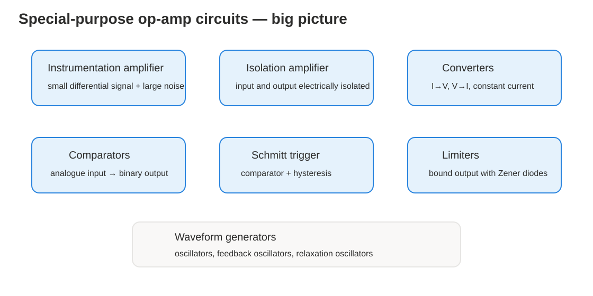
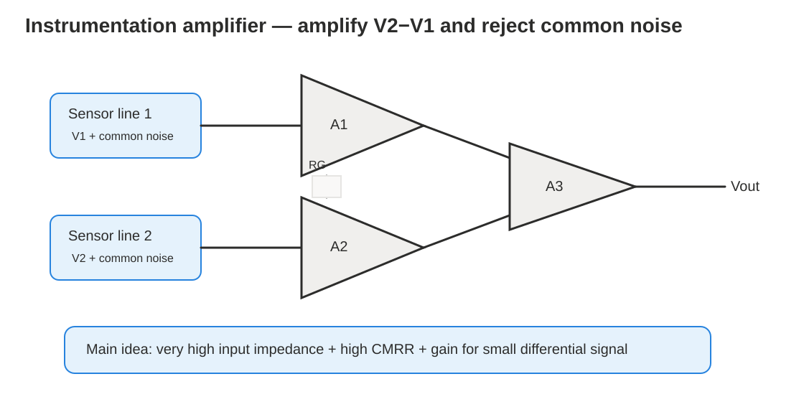
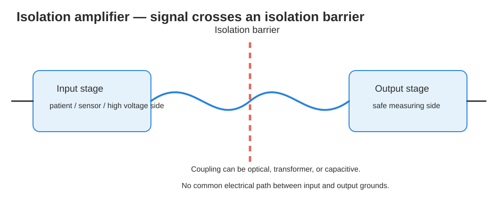
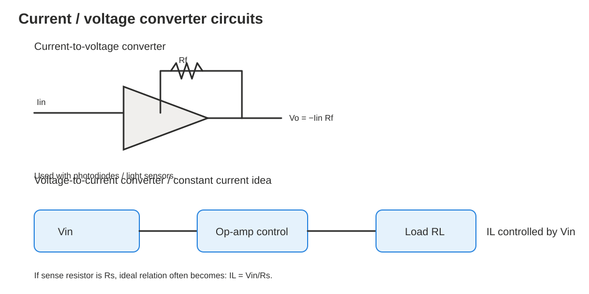
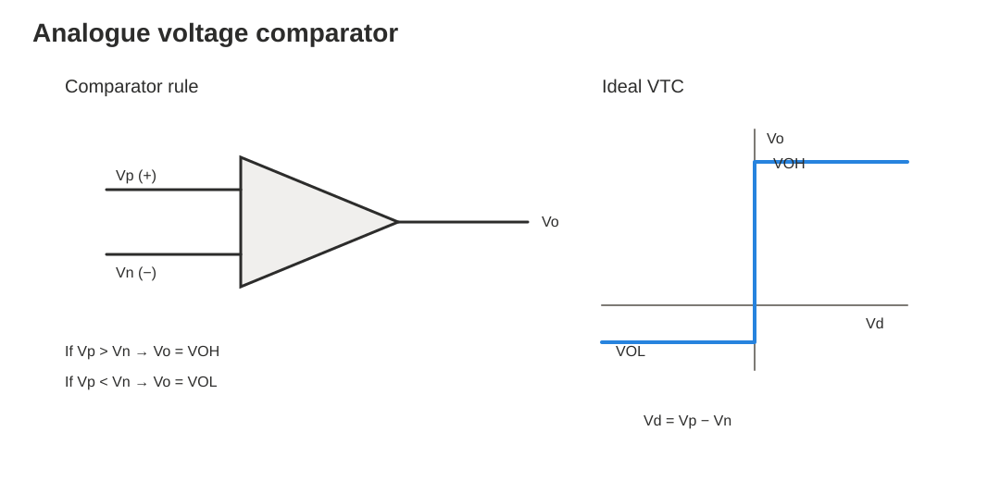
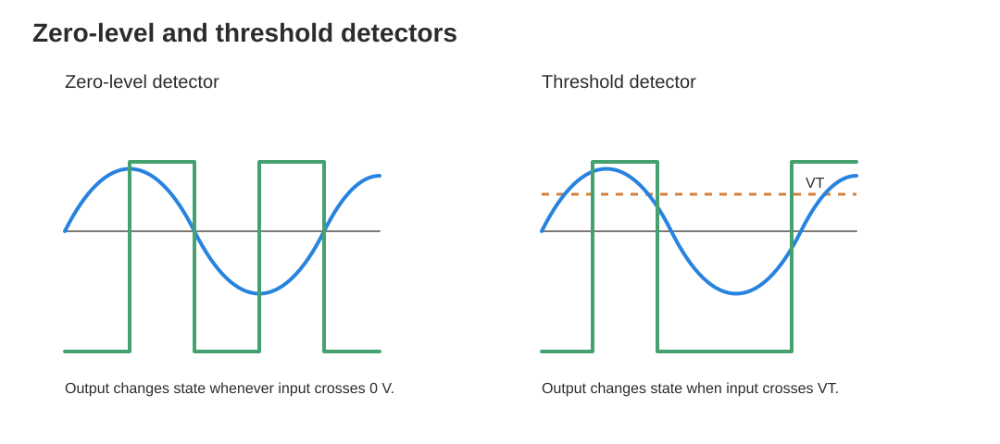
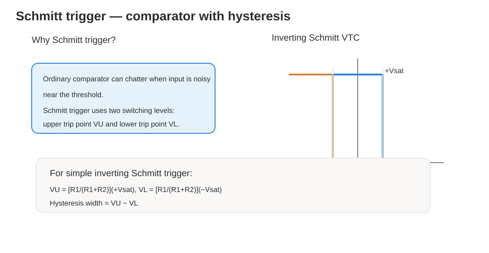
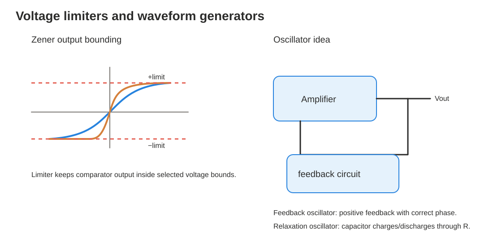

# Special-Purpose Op-Amp Circuits — Zero to Hero Study File

**Based on Upload 9 and Upload 10 PDFs**  
Topics: **instrumentation amplifiers, isolation amplifiers, current sources, I-to-V and V-to-I converters, comparators, detectors, Schmitt triggers, voltage limiters, oscillators and waveform generation.**

This file explains the lecture content clearly, step by step, with formulas and exam-style examples.

---

## How to study this file

1. First understand the **purpose** of each circuit.
2. Then learn the **main formula**.
3. Then learn the **input-output behavior**.
4. Finally solve the practice problems at the end.



---

# Part A — Instrumentation Amplifiers

## 1. Why do we need instrumentation amplifiers?

Sometimes we need to measure a **very small useful signal** while a large unwanted common signal is also present.

Example:

```text
Sensor signal = 5 mV
Noise/common-mode voltage = 2 V
```

The useful signal is tiny compared with the common-mode voltage. A normal amplifier may amplify both and cause error.

An **instrumentation amplifier**, also called an **in-amp**, solves this problem.

---

## 2. Definition

An instrumentation amplifier is a differential voltage-gain circuit that amplifies the difference between two input voltages.

```text
Useful signal = V2 - V1
```

It rejects common-mode voltage.

If both inputs contain the same noise:

```text
V1 = signal1 + noise
V2 = signal2 + noise
```

then:

```text
V2 - V1 = signal2 - signal1
```

The common noise cancels.

---

## 3. Main characteristics

Instrumentation amplifiers have:

- very high input impedance
- high common-mode rejection ratio, CMRR
- low output offset
- low output impedance
- accurate differential gain

These are useful for sensors and measurement systems.

---

## 4. Three-op-amp instrumentation amplifier



A common instrumentation amplifier has three op-amps:

```text
A1 and A2 = input buffer/gain stages
A3 = differential amplifier stage
```

## 4.1 A1 and A2

A1 and A2 are usually non-inverting stages.

They give:

- high input impedance
- initial voltage gain

Because input impedance is high, the sensor is not loaded.

## 4.2 A3

A3 is a difference amplifier.

It subtracts the two amplified signals.

If the resistors in A3 are equal or carefully matched, common-mode rejection becomes high.

---

## 5. Standard gain formula

For the common 3-op-amp instrumentation amplifier, if the input-stage resistors are equal and a gain-setting resistor is `RG`, the gain is commonly written as:

```text
Gain = 1 + 2R/RG
```

If the output difference amplifier has unity gain:

```text
Vout = (1 + 2R/RG)(V2 - V1)
```

If the final difference amplifier has gain `Gdiff`, then:

```text
Vout = Gdiff(1 + 2R/RG)(V2 - V1)
```

In many lecture diagrams, the final differential amplifier uses equal resistors, so its gain is 1.

---

## 6. Why gain can be adjusted easily

Only one resistor, `RG`, controls the gain.

If `RG` decreases:

```text
2R/RG increases
```

so gain increases.

If `RG` increases, gain decreases.

This is useful because we can set gain without disturbing input impedance.

---

## 7. Applications of instrumentation amplifier

Instrumentation amplifiers are used when a small signal is sent over a noisy line.

Examples:

- temperature sensors
- pressure sensors
- biomedical measurement
- strain gauges
- remote sensing
- data acquisition systems

The in-amp amplifies the small differential signal and rejects the common noise.

---

# Part B — Isolation Amplifiers

## 8. What is an isolation amplifier?

An isolation amplifier provides DC electrical isolation between input and output.

That means:

```text
input ground and output ground are not directly connected
```

But the signal can still pass across an isolation barrier.



---

## 9. Why isolation is needed

Isolation is used for:

- protecting human life
- protecting sensitive equipment
- preventing dangerous leakage currents
- rejecting high-voltage transients
- breaking ground loops

Common applications:

- medical instruments
- power plant instrumentation
- industrial processing
- automated testing

---

## 10. How signal crosses the barrier

Different isolation amplifiers use different coupling methods:

```text
optical coupling
transformer coupling
capacitive coupling
```

Modern isolation amplifiers often use capacitive coupling.

Each side has separate:

```text
supply voltage
 ground
```

So there is no common electrical path.

---

# Part C — Current and Voltage Converter Circuits



---

## 11. Constant-current source

A constant-current source gives a load current that stays approximately constant even if load resistance changes.

Ideal behavior:

```text
IL = constant
```

even when:

```text
RL changes
```

This is useful for:

- LED driving
- sensor excitation
- battery charging
- measurement circuits

Remember: practical op-amps have voltage and current limits, so current cannot remain constant for every possible load.

---

## 12. Current-to-voltage converter

A current-to-voltage converter changes an input current into a proportional output voltage.

It is also called a **transimpedance amplifier**.

For an inverting current-to-voltage converter:

```text
Vo = -Iin Rf
```

where:

```text
Iin = input current
Rf = feedback resistor
```

## 12.1 Why negative sign appears

The current enters the inverting node. The op-amp output moves in the opposite direction to keep the inverting input near virtual ground.

So positive input current gives negative output voltage.

---

## 13. Current-to-voltage example

Given:

```text
Iin = 20 μA
Rf = 100 kΩ
```

Output:

```text
Vo = -Iin Rf
```

```text
Vo = -(20×10^-6)(100×10^3)
```

```text
Vo = -2 V
```

---

## 14. Application: photodiode / light sensor

A photodiode or photoconductive cell can produce current depending on light.

More light:

```text
more current
```

The current-to-voltage converter turns that current into a voltage that can be measured.

---

## 15. Voltage-to-current converter

A voltage-to-current converter gives an output current controlled by input voltage.

Common ideal relation:

```text
IL = Vin/Rs
```

where:

```text
Rs = sense resistor
```

Meaning:

- increase `Vin` → load current increases
- decrease `Vin` → load current decreases

This is useful when we need current controlled by voltage.

---

# Part D — Analogue Voltage Comparator

## 16. What is a comparator?

A comparator compares two input voltages and gives either a high or low output.

It converts analogue input information into a binary output.

So a comparator is like a one-bit analogue-to-digital converter.



---

## 17. Comparator rule

Let:

```text
Vp = non-inverting input voltage
Vn = inverting input voltage
```

If:

```text
Vp > Vn
```

then:

```text
Vo = VOH
```

If:

```text
Vp < Vn
```

then:

```text
Vo = VOL
```

Using differential input voltage:

```text
Vd = Vp - Vn
```

Then:

```text
Vo = VOH for Vd > 0
Vo = VOL for Vd < 0
```

---

## 18. Ideal voltage transfer curve

The ideal comparator switches instantly at:

```text
Vd = 0
```

If `Vd` is positive, output is high.  
If `Vd` is negative, output is low.

But practical op-amps have finite gain, so there is a tiny linear region.

---

## 19. Practical op-amp comparator example

For a 741 op-amp:

```text
Supply = ±15 V
Vsat ≈ ±13.5 V
AOL = 10^5
```

The differential input voltage needed to saturate is:

```text
Vin(sat) = Vsat/AOL
```

```text
Vin(sat) = 13.5/(10^5)
```

```text
Vin(sat) = 135 μV
```

So:

```text
Vd > +135 μV → Vo = +13.5 V
Vd < -135 μV → Vo = -13.5 V
```

Between `-135 μV` and `+135 μV`, the op-amp is in its small linear region.

This is why op-amps can act as comparators: very small input difference causes saturated output.

---

## 20. Non-inverting comparator

A comparator is non-inverting if output goes high when input goes above the reference.

If reference is 0 V:

```text
Vo = +Vsat for Vin > 0
Vo = -Vsat for Vin < 0
```

---

## 21. Inverting comparator

A comparator is inverting if output goes low when input goes above the reference.

If reference is 0 V:

```text
Vo = -Vsat for Vin > 0
Vo = +Vsat for Vin < 0
```

---

# Part E — Detectors

## 22. Zero-level detector

A zero-level detector changes output state when the input crosses zero volts.



For sine wave input:

- when input crosses from negative to positive, output switches
- when input crosses from positive to negative, output switches again

So output becomes a square wave.

---

## 23. Threshold detector

A threshold detector switches when input crosses a selected voltage level `VT`, not necessarily zero.

For non-inverting threshold detector:

```text
Vo = +Vsat for Vin > VT
Vo = -Vsat for Vin < VT
```

For inverting threshold detector:

```text
Vo = -Vsat for Vin > VT
Vo = +Vsat for Vin < VT
```

---

## 24. How to create threshold voltage

Threshold/reference voltage can be created using:

1. Battery reference
2. Voltage divider
3. Zener diode reference

For voltage divider:

```text
VR = [R2/(R1 + R2)](+Vc)
```

This `VR` becomes the threshold voltage.

---

## 25. Threshold detector application

Comparator can be used as a controller.

Examples:

- temperature alarm
- pressure alarm
- light detector

Example idea:

```text
if temperature voltage > threshold → alarm ON
```

---

# Part F — Schmitt Trigger

## 26. Problem with ordinary comparator

If input is noisy near the threshold, an ordinary comparator may switch many times quickly.

This is called chatter.

A Schmitt trigger solves this by using **positive feedback** and two threshold levels.

---

## 27. What is a Schmitt trigger?

A Schmitt trigger is a comparator with positive feedback.

It has two trip points:

```text
VU = upper trip point
VL = lower trip point
```

The difference between them is called hysteresis.

```text
hysteresis width = VU - VL
```



---

## 28. Why hysteresis helps

The circuit does not switch back at the same voltage where it switched forward.

It must cross a second threshold to switch back.

Therefore small noise near one threshold does not cause repeated switching.

This converts irregular waveforms into clean square waves.

---

## 29. Inverting Schmitt trigger

An inverting Schmitt trigger uses positive feedback to the non-inverting input, while the input is applied to the inverting input.

For simple symmetrical inverting Schmitt trigger:

```text
VU = [R1/(R1 + R2)](+Vsat)
```

```text
VL = [R1/(R1 + R2)](-Vsat)
```

So if `Vsat = ±13.5 V`, trip points depend on resistor ratio.

---

## 30. Example: inverting Schmitt trigger trip points

Given:

```text
R1 = 10 kΩ
R2 = 20 kΩ
Vsat = ±12 V
```

Upper trip point:

```text
VU = [R1/(R1+R2)](+Vsat)
```

```text
VU = [10/(10+20)](12)
```

```text
VU = (1/3)(12) = 4 V
```

Lower trip point:

```text
VL = [10/(30)](-12)
```

```text
VL = -4 V
```

Hysteresis width:

```text
VU - VL = 4 - (-4) = 8 V
```

---

## 31. Shifted inverting Schmitt trigger

Trip points can be shifted by adding another resistor to a DC supply.

Using Thevenin equivalent, the reference is shifted by:

```text
Vc = [R1/(R1 + R3)]Vcc
```

The trip points become shifted around this reference:

```text
VU = Vc + [(R1||R3)/(R2 + (R1||R3))](+Vsat)
```

```text
VL = Vc + [(R1||R3)/(R2 + (R1||R3))](-Vsat)
```

Meaning:

- `Vc` shifts the center point
- the resistor ratio controls hysteresis size

---

## 32. Non-inverting Schmitt trigger

A non-inverting Schmitt trigger applies input to the non-inverting side and uses positive feedback.

For the simple case, the trip points are proportional to saturation voltage and resistor ratio.

Main idea:

- input rising crosses upper threshold → output changes state
- input falling crosses lower threshold → output changes back

This also produces hysteresis.

---

# Part G — Voltage Limiters / Output Bounding

## 33. Why limit comparator output?

Sometimes full op-amp saturation output is too large.

Example:

```text
op-amp output = ±13.5 V
logic circuit accepts 0 to 5 V only
```

So we use limiters to bound the output voltage.



---

## 34. Zener limiter

A Zener diode can limit the output in one direction.

If Zener is placed to limit positive output:

```text
positive output limit ≈ +Vz
```

In the other direction, the diode may conduct like a normal diode:

```text
negative limit ≈ -0.7 V
```

If Zener is reversed, the limiting direction is reversed.

---

## 35. Two-Zener limiter

Two Zener diodes can limit both positive and negative output levels.

Approximate limits:

```text
positive limit ≈ +Vz2 + 0.7 V
```

```text
negative limit ≈ -Vz1 - 0.7 V
```

The `0.7 V` appears because one diode is forward biased while the other is in Zener breakdown.

---

# Part H — Waveform Generators and Oscillators

## 36. Basic waveform generator idea

Waveform generators produce periodic output waveforms using only DC supply power.

Common output waveforms:

- sine wave
- square wave
- sawtooth wave
- ramp wave

---

## 37. Oscillator

An oscillator is a circuit that produces a periodic waveform without an external periodic input.

It only needs DC supply voltage.

```text
DC supply → oscillator → AC waveform
```

---

## 38. Feedback oscillator

A feedback oscillator uses:

```text
amplifier + positive feedback network
```

The feedback signal returns to the input with no net phase shift, so it reinforces the output.

Main conditions:

1. correct phase shift, total phase shift = 0° or 360°
2. enough loop gain to sustain oscillation

This is the basic Barkhausen idea.

---

## 39. Relaxation oscillator

A relaxation oscillator uses:

```text
RC timing circuit + switching circuit
```

Usually a Schmitt trigger is used.

The capacitor charges and discharges through a resistor. When capacitor voltage reaches a threshold, the comparator changes state.

This produces non-sinusoidal waveforms such as:

- square wave
- ramp wave
- sawtooth wave

---

# Part I — Quick Formula Sheet

## Instrumentation amplifier

```text
Vout = (1 + 2R/RG)(V2 - V1)
```

for unity-gain final differential stage.

## Current-to-voltage converter

```text
Vo = -Iin Rf
```

## Voltage-to-current converter

```text
IL = Vin/Rs
```

ideal form.

## Comparator

```text
Vd = Vp - Vn
```

```text
Vo = VOH for Vd > 0
Vo = VOL for Vd < 0
```

## 741 comparator small linear region

```text
Vin(sat) = Vsat/AOL
```

## Voltage divider threshold

```text
VR = [R2/(R1+R2)]Vc
```

## Simple inverting Schmitt trigger

```text
VU = [R1/(R1+R2)](+Vsat)
```

```text
VL = [R1/(R1+R2)](-Vsat)
```

## Shifted inverting Schmitt trigger

```text
Vc = [R1/(R1+R3)]Vcc
```

```text
VU = Vc + [(R1||R3)/(R2+(R1||R3))](+Vsat)
```

```text
VL = Vc + [(R1||R3)/(R2+(R1||R3))](-Vsat)
```

## Two-Zener output bounding

```text
positive limit ≈ +Vz2 + 0.7 V
negative limit ≈ -Vz1 - 0.7 V
```

---

# Part J — Worked Examples

## Example 1 — Instrumentation amplifier output

Given:

```text
V1 = 1.000 V
V2 = 1.020 V
R = 10 kΩ
RG = 1 kΩ
```

Find output, assuming unity-gain final difference amplifier.

Difference input:

```text
V2 - V1 = 1.020 - 1.000 = 0.020 V
```

Gain:

```text
G = 1 + 2R/RG
```

```text
G = 1 + 2(10k)/1k
```

```text
G = 1 + 20 = 21
```

Output:

```text
Vout = 21(0.020)
```

```text
Vout = 0.42 V
```

---

## Example 2 — Current-to-voltage converter

Given:

```text
Iin = 15 μA
Rf = 220 kΩ
```

Find output.

```text
Vo = -IinRf
```

```text
Vo = -(15×10^-6)(220×10^3)
```

```text
Vo = -3.3 V
```

---

## Example 3 — Comparator saturation input

Given:

```text
Vsat = 13.5 V
AOL = 100,000
```

Find differential input needed to saturate.

```text
Vin(sat) = Vsat/AOL
```

```text
Vin(sat) = 13.5/100000
```

```text
Vin(sat) = 0.000135 V
```

```text
Vin(sat) = 135 μV
```

---

## Example 4 — Voltage divider threshold

Given:

```text
Vc = 12 V
R1 = 10 kΩ
R2 = 5 kΩ
```

Find threshold voltage.

```text
VR = [R2/(R1+R2)]Vc
```

```text
VR = [5/(10+5)](12)
```

```text
VR = (1/3)(12)
```

```text
VR = 4 V
```

---

## Example 5 — Schmitt trigger trip points

Given:

```text
R1 = 10 kΩ
R2 = 40 kΩ
Vsat = ±10 V
```

Upper trip point:

```text
VU = [R1/(R1+R2)](+Vsat)
```

```text
VU = [10/(10+40)](10)
```

```text
VU = 2 V
```

Lower trip point:

```text
VL = [10/50](-10)
```

```text
VL = -2 V
```

Hysteresis width:

```text
VU - VL = 2 - (-2) = 4 V
```

---

# Part K — Extra 5 Practice Problems with Solutions

## Problem 1 — Instrumentation amplifier

An instrumentation amplifier has:

```text
R = 20 kΩ
RG = 2 kΩ
V1 = 2.000 V
V2 = 2.015 V
```

Find `Vout` assuming final differential stage gain is 1.

### Solution

Difference:

```text
V2 - V1 = 2.015 - 2.000 = 0.015 V
```

Gain:

```text
G = 1 + 2R/RG
```

```text
G = 1 + 2(20k)/2k
```

```text
G = 1 + 20 = 21
```

Output:

```text
Vout = 21(0.015)
```

```text
Vout = 0.315 V
```

---

## Problem 2 — Current-to-voltage converter

A photodiode produces:

```text
Iin = 8 μA
```

Feedback resistor:

```text
Rf = 470 kΩ
```

Find `Vo`.

### Solution

```text
Vo = -IinRf
```

```text
Vo = -(8×10^-6)(470×10^3)
```

```text
Vo = -3.76 V
```

---

## Problem 3 — Voltage-to-current converter

A voltage-to-current converter has:

```text
Vin = 2.5 V
Rs = 500 Ω
```

Find ideal load current.

### Solution

```text
IL = Vin/Rs
```

```text
IL = 2.5/500
```

```text
IL = 0.005 A
```

```text
IL = 5 mA
```

---

## Problem 4 — Threshold detector

A non-inverting threshold detector has:

```text
VT = 3 V
Vsat = ±12 V
```

Find output for:

1. `Vin = 2 V`
2. `Vin = 5 V`

### Solution

Non-inverting threshold detector:

```text
Vo = +Vsat for Vin > VT
Vo = -Vsat for Vin < VT
```

For `Vin = 2 V`:

```text
2 V < 3 V
```

```text
Vo = -12 V
```

For `Vin = 5 V`:

```text
5 V > 3 V
```

```text
Vo = +12 V
```

---

## Problem 5 — Zener limiter

A two-Zener limiter has:

```text
Vz1 = 4.7 V
Vz2 = 5.6 V
```

Find approximate positive and negative limits.

### Solution

Positive limit:

```text
+limit ≈ +Vz2 + 0.7
```

```text
+limit ≈ 5.6 + 0.7 = 6.3 V
```

Negative limit:

```text
-limit ≈ -Vz1 - 0.7
```

```text
-limit ≈ -4.7 - 0.7 = -5.4 V
```

Answer:

```text
positive limit ≈ +6.3 V
negative limit ≈ -5.4 V
```

---

# Final exam memory points

- Instrumentation amplifier amplifies `V2 - V1` and rejects common-mode noise.
- Isolation amplifier protects people/equipment by separating input and output electrically.
- Current-to-voltage converter formula is `Vo = -IinRf`.
- Voltage-to-current converter ideal formula is `IL = Vin/Rs`.
- Comparator output is high or low depending on `Vp - Vn`.
- Zero detector switches at 0 V.
- Threshold detector switches at `VT`.
- Schmitt trigger has two thresholds, `VU` and `VL`.
- Hysteresis prevents noisy switching/chatter.
- Zener limiters bound output voltage.
- Oscillators create periodic waveforms using DC supply.
- Relaxation oscillators use RC charging/discharging and switching thresholds.
