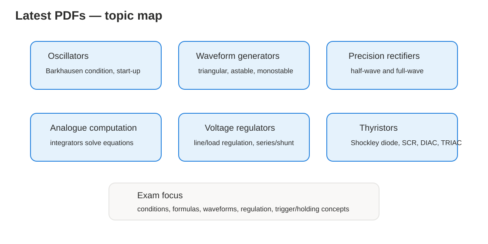
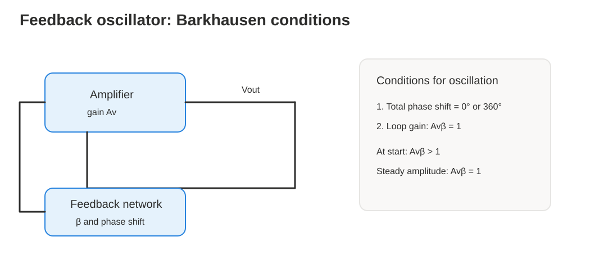
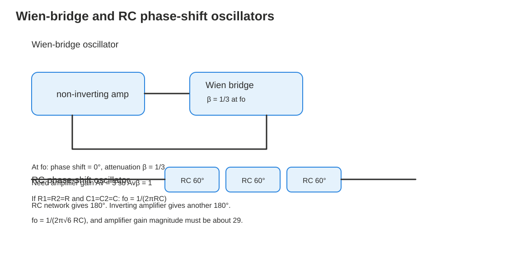
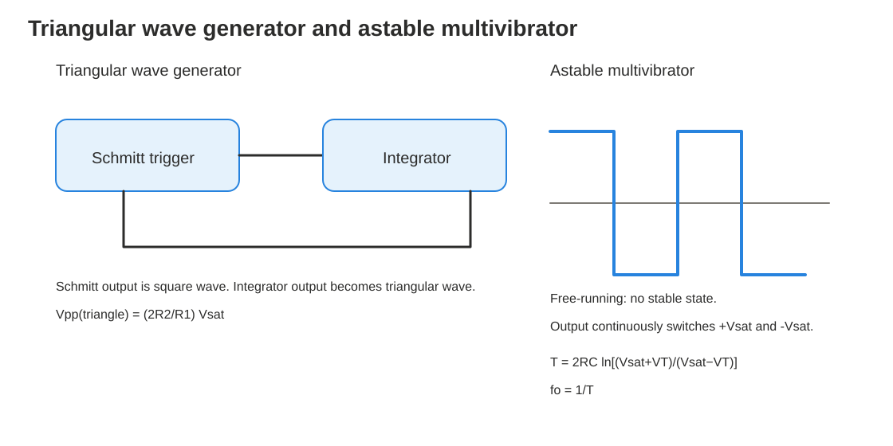
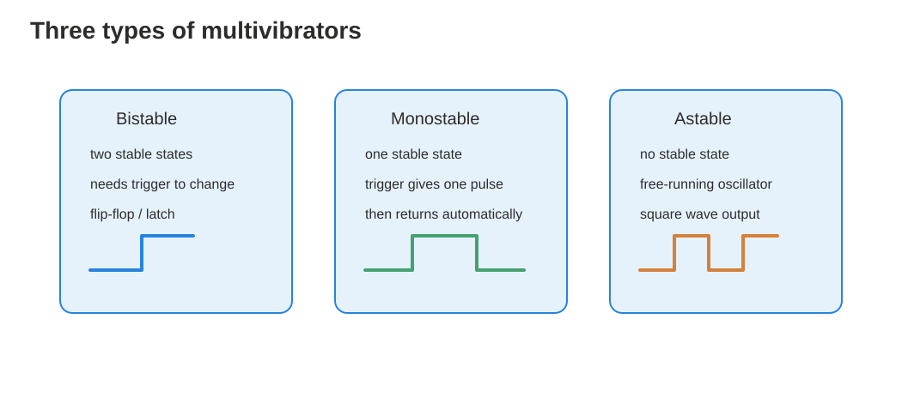
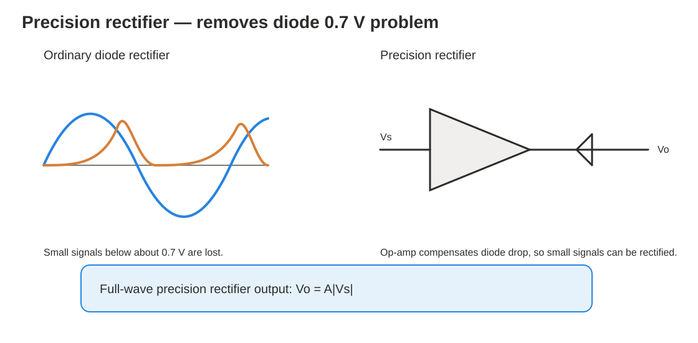
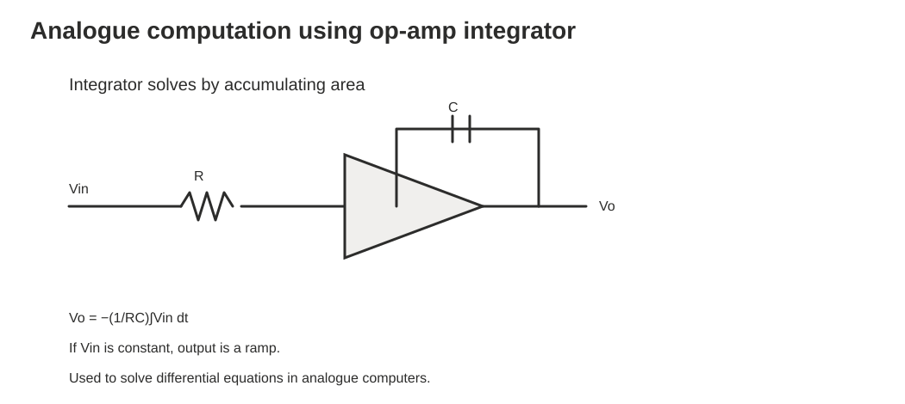
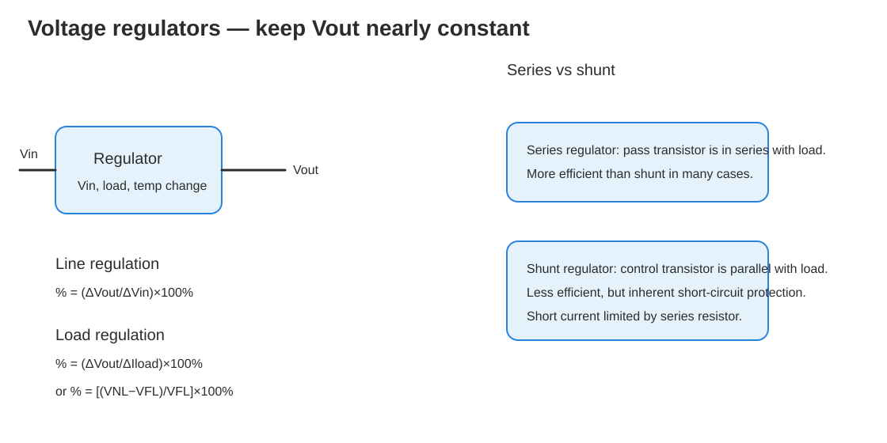
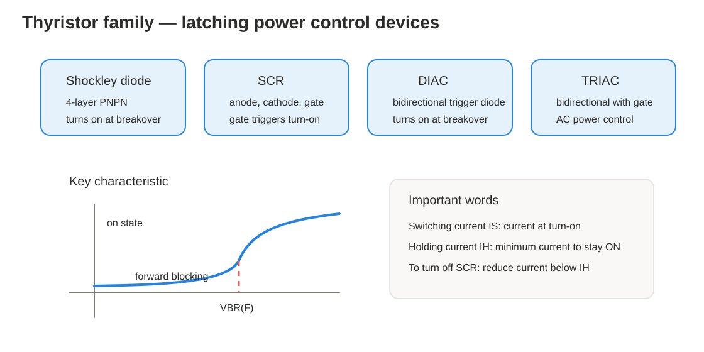
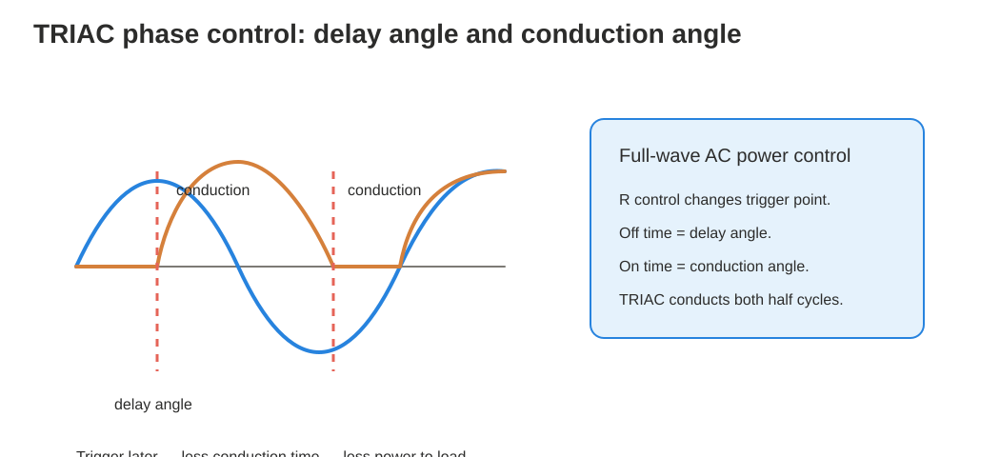

# Waveform Generators, Rectifiers, Regulators and Thyristors — Zero to Hero Guide

**Based on Upload 11, Upload 12 and Upload 13 PDFs**  
This Markdown file is written for exam study. It explains the topics clearly, step by step, with formulas, diagrams, worked examples, and 5 extra practice problems.

---

## Topic map



The uploaded PDFs cover four big areas:

1. **Waveform generators and oscillators**
2. **Precision rectifiers and analogue computation**
3. **Voltage regulators**
4. **Thyristors and AC power control**

---

# Part A — Oscillators

## 1. What is an oscillator?

An oscillator is a circuit that produces a periodic waveform using only a DC power supply.

```text
DC supply → oscillator → AC waveform
```

Output can be:

- sine wave
- square wave
- triangular wave
- sawtooth wave

---

## 2. Feedback oscillator idea

A feedback oscillator uses:

```text
amplifier + feedback network
```

Part of output is fed back to the input. If the feedback is positive at the required frequency, oscillation builds up.



---

## 3. Conditions for oscillation — Barkhausen condition

For sustained oscillation:

## Condition 1: total phase shift must be 0° or 360°

The feedback signal must arrive back at the input **in phase** with the original signal.

```text
Total phase shift around loop = 0° or 360°
```

## Condition 2: loop gain must be unity

Loop gain:

```text
ACL = Avβ
```

where:

```text
Av = amplifier gain
β = feedback attenuation factor
```

For sustained oscillation:

```text
Avβ = 1
```

---

## 4. Start-up condition

At the very beginning, there is no output signal. So how does oscillation start?

It starts from tiny noise:

- thermal noise in resistors
- power supply switching disturbance
- transistor noise

The feedback network selects only the required frequency and feeds it back in phase.

For start-up:

```text
Avβ > 1
```

Then oscillation grows.

When amplitude becomes steady:

```text
Avβ = 1
```

If loop gain stays greater than 1, output grows until clipping/distortion.

---

# Part B — Wien-Bridge Oscillator

## 5. What is the Wien-bridge oscillator?

A Wien-bridge oscillator is a sine-wave oscillator using an op-amp and an RC feedback network.



At the oscillation frequency:

```text
phase shift = 0°
```

and feedback attenuation is:

```text
β = 1/3
```

Therefore the amplifier gain must be:

```text
Av = 3
```

because:

```text
Avβ = 3 × 1/3 = 1
```

---

## 6. Wien-bridge oscillator frequency

For equal components:

```text
R1 = R2 = R
C1 = C2 = C
```

oscillation frequency is:

```text
fo = 1/(2πRC)
```

---

## 7. Wien-bridge amplifier gain

If the op-amp is non-inverting:

```text
Av = 1 + Rf/Rg
```

For oscillation:

```text
Av = 3
```

So:

```text
1 + Rf/Rg = 3
```

```text
Rf/Rg = 2
```

Therefore:

```text
Rf = 2Rg
```

---

# Part C — RC Phase-Shift Oscillator

## 8. Basic idea

An RC phase-shift oscillator uses:

- inverting amplifier: gives 180° phase shift
- RC feedback network: gives another 180° phase shift

Total:

```text
180° + 180° = 360°
```

So the feedback is effectively in phase.

---

## 9. Oscillation frequency

For three identical RC sections:

```text
fo = 1/(2π√6 RC)
```

---

## 10. Required gain

For the three-section RC phase-shift network, the feedback attenuation at the oscillation frequency is approximately:

```text
β = 1/29
```

So amplifier gain magnitude must be:

```text
|Av| = 29
```

For inverting op-amp amplifier:

```text
|Av| = Rf/R1
```

Therefore:

```text
Rf/R1 = 29
```

---

# Part D — Triangular Wave Generator and Multivibrators

## 11. Triangular wave generator

A triangular wave generator can be made using:

```text
Schmitt trigger + integrator
```



The Schmitt trigger output is a square wave.  
The integrator integrates the square wave and produces a triangular wave.

---

## 12. Why square wave becomes triangular wave

A square wave has constant positive voltage and constant negative voltage.

For an integrator:

```text
Vo = -(1/RC)∫Vin dt
```

Integral of a constant is a ramp.

So:

```text
positive constant → ramp in one direction
negative constant → ramp in opposite direction
```

Therefore:

```text
square wave → triangular wave
```

---

## 13. Triangular wave peak-to-peak voltage

From the slides:

```text
(VOT)pp = (2R2/R1)Vsat
```

where:

```text
Vsat = Schmitt trigger saturation voltage
R1, R2 = Schmitt trigger resistor values
```

---

## 14. Multivibrators



There are three types:

1. Bistable multivibrator
2. Monostable multivibrator
3. Astable multivibrator

---

## 15. Bistable multivibrator

A bistable multivibrator has two stable states.

It stays in one state until a trigger changes it.

Examples:

- flip-flop
- latch
- Schmitt trigger

Important point:

```text
Needs triggers to change state.
```

---

## 16. Monostable multivibrator

A monostable multivibrator has one stable state and one quasi-stable state.

When a trigger comes:

1. output changes to quasi-stable state
2. stays there for fixed time
3. returns automatically to stable state

It generates a single pulse.

Also called:

```text
one-shot multivibrator
```

---

## 17. Astable multivibrator

An astable multivibrator has no stable state.

It continuously switches between two quasi-stable states.

So it is free-running and produces a square wave without external trigger.

---

## 18. Astable multivibrator period

From slides:

```text
T = 2RC ln[(Vsat + VT)/(Vsat - VT)]
```

Frequency:

```text
fo = 1/T
```

For the resistor divider threshold in the slide:

```text
VT = [R2/(R1+R2)]Vsat
```

The slide also gives:

```text
fo = 1 / {2RC ln[1 + (2R2/R1)]}
```

This is a useful exam formula.

---

# Part E — Precision Rectifiers

## 19. Ordinary half-wave rectifier problem

A normal diode rectifier has a diode voltage drop of about:

```text
VD ≈ 0.7 V
```

So small signals below 0.7 V are not rectified properly.

Example:

```text
input = 0.2 V
```

A silicon diode may not conduct, so output is almost zero.

This is a problem for small-signal rectification.

---

## 20. Precision rectifier

A precision rectifier uses an op-amp with diode(s) to overcome the 0.7 V diode drop problem.



The op-amp output provides extra voltage to make the diode conduct even for small inputs.

So precision rectifiers can rectify very small signals.

---

## 21. Inverting precision half-wave rectifier

For one common inverting half-wave rectifier:

If:

```text
Vs > 0
```

then output can be:

```text
Vo = 0
```

depending on diode orientation.

If:

```text
Vs < 0
```

then:

```text
Vo = -(R2/R1)Vs
```

Since `Vs` is negative, output becomes positive.

---

## 22. Precision full-wave rectifier

A precision full-wave rectifier rectifies both halves of the input waveform.

Output:

```text
Vo = A|Vs|
```

where:

```text
A = gain
```

So the output is always positive and proportional to input magnitude.

---

# Part F — Electronic Analogue Computation

## 23. Analogue computer idea

An analogue computer processes continuous physical quantities instead of discrete numbers.

It uses circuits such as:

- summers
- integrators
- multipliers
- function generators
- comparators

---

## 24. Op-amp integrator as computing element



Integrator formula:

```text
Vo = -(1/RC)∫Vin dt
```

This can solve equations involving integration.

---

## 25. Example: solving dV/dt = C

Given differential equation:

```text
dV/dt = C
```

Integrate both sides:

```text
∫(dV/dt)dt = ∫C dt
```

```text
V = Ct + D
```

where `D` is a constant.

So if a constant voltage is applied to an integrator, output becomes a ramp.

---

## 26. Example: solving dV/dt = V1

If `V1` is constant:

```text
dV/dt = V1
```

Integrate:

```text
V = V1t + C
```

If at `t=0`, `V = V0`, then:

```text
C = V0
```

So:

```text
V = V1t + V0
```

---

# Part G — Voltage Regulators

## 27. What is a voltage regulator?

A voltage regulator gives a nearly constant output voltage even when:

- input voltage changes
- load current changes
- temperature changes



---

## 28. Line regulation

Line regulation measures how output voltage changes when input voltage changes.

```text
Line regulation = (ΔVout/ΔVin) × 100%
```

Smaller value means better regulation.

---

## 29. Load regulation

Load regulation measures how output voltage changes when load current changes.

```text
Load regulation = (ΔVout/ΔIload) × 100%
```

Another common form:

```text
Load regulation = [(VNL - VFL)/VFL] × 100%
```

where:

```text
VNL = no-load output voltage
VFL = full-load output voltage
```

---

## 30. Linear regulators

Two main types:

1. Series regulator
2. Shunt regulator

---

## 31. Series regulator

In a series regulator, the control/pass transistor is in series with the load.

Basic idea:

```text
Vin → pass transistor → load
```

An op-amp error detector compares a sample of output with a reference voltage and controls the pass transistor.

If output tries to fall, the op-amp drives the transistor harder.

If output tries to rise, the op-amp reduces transistor drive.

---

## 32. Series regulator output voltage

For a typical op-amp series regulator with sample divider:

```text
Vout = VREF(1 + R1/R2)
```

or depending on resistor labeling:

```text
Vout = VREF[(R1+R2)/R2]
```

The important idea is:

```text
sampled output = reference voltage
```

---

## 33. Current limiting in series regulator

If load current becomes too high, the pass transistor can be damaged.

A current-limiting transistor and resistor are used.

Approximate current limit:

```text
IL(max) = VBE/R4
```

Usually:

```text
VBE ≈ 0.7 V
```

So:

```text
R4 = 0.7/IL(max)
```

---

## 34. Shunt regulator

In a shunt regulator, the control element is parallel with the load.

It diverts extra current away from the load to keep output voltage constant.

Shunt regulators are less efficient because current is continuously wasted.

But they have inherent short-circuit protection.

---

## 35. Shunt regulator short-circuit current

If output is shorted:

```text
Vout = 0
```

The maximum current is limited by the series resistor:

```text
Imax = Vin/R1
```

Power in resistor:

```text
P = I²R
```

or:

```text
P = V²/R
```

This is why the resistor may need a high power rating.

---

## 36. Fixed voltage regulators

Common positive regulators:

```text
7805 → +5 V
7806 → +6 V
7808 → +8 V
7809 → +9 V
7812 → +12 V
7815 → +15 V
7824 → +24 V
```

Common negative regulators:

```text
7905 → -5 V
7906 → -6 V
7908 → -8 V
7912 → -12 V
7915 → -15 V
7924 → -24 V
```

Adjustable regulators:

```text
LM317 → positive adjustable
LM337 → negative adjustable
```

---

# Part H — Thyristors and Power Control

## 37. What is a thyristor?

Thyristors are power semiconductor devices with four semiconductor layers.

They are used to control AC or DC power.

Types:

- Shockley diode / 4-layer diode
- SCR
- SCS
- DIAC
- TRIAC



---

## 38. Four-layer diode / Shockley diode

A 4-layer diode has PNPN structure.

It behaves like a diode, but it does not conduct immediately in forward bias.

It turns on only when anode-cathode voltage reaches:

```text
forward breakover voltage VBR(F)
```

---

## 39. Important thyristor terms

## Forward blocking region

Before breakover, the device is forward biased but still off.

## Forward breakover voltage

Voltage where the device turns on.

```text
VBR(F)
```

## Switching current

Current at which device switches from off to on.

```text
IS
```

## Holding current

Minimum current needed to keep the device on.

```text
IH
```

If current falls below `IH`, the device turns off.

---

## 40. SCR — Silicon Controlled Rectifier

An SCR is a four-layer device with three terminals:

```text
anode
cathode
gate
```

A gate pulse turns it on when it is forward biased.

Once on, it stays on even if the gate signal is removed, as long as anode current is greater than holding current.

To turn off SCR:

```text
reduce anode current below IH
```

---

## 41. DIAC

A DIAC is a bidirectional trigger device.

It conducts in both directions after breakover voltage is reached.

It is often used to trigger TRIACs.

---

## 42. TRIAC

A TRIAC is like a bidirectional SCR with a gate.

It can conduct in both directions, so it is useful for AC power control.

A gate pulse can trigger it on during either half-cycle.

---

## 43. Full-wave power control using TRIAC



In TRIAC phase control, the trigger point is delayed after each zero crossing.

The off time is called:

```text
delay angle
```

The on time is called:

```text
conduction angle
```

If the TRIAC is triggered later:

```text
less conduction time → less power to load
```

If triggered earlier:

```text
more conduction time → more power to load
```

Applications:

- lamp dimmers
- heater controls
- motor speed controls

---

# Part I — Worked Examples

## Example 1 — Wien-bridge oscillator frequency

Given:

```text
R = 10 kΩ
C = 0.01 μF
```

Find oscillation frequency.

```text
fo = 1/(2πRC)
```

```text
fo = 1/[2π(10,000)(10×10^-9)]
```

```text
fo ≈ 1591 Hz
```

---

## Example 2 — RC phase-shift oscillator frequency

Given:

```text
R = 10 kΩ
C = 0.01 μF
```

```text
fo = 1/(2π√6 RC)
```

```text
fo = 1/[2π(2.449)(10,000)(10×10^-9)]
```

```text
fo ≈ 650 Hz
```

---

## Example 3 — Astable multivibrator frequency

Given:

```text
R = 10 kΩ
C = 0.1 μF
R1 = R2
```

Using:

```text
fo = 1 / {2RC ln[1 + 2R2/R1]}
```

Since `R1 = R2`:

```text
1 + 2R2/R1 = 1 + 2 = 3
```

```text
RC = (10,000)(0.1×10^-6) = 0.001 s
```

```text
fo = 1/[2(0.001)ln(3)]
```

```text
fo = 1/[0.002(1.099)]
```

```text
fo ≈ 455 Hz
```

---

## Example 4 — Series regulator current-limit resistor

Given maximum current:

```text
IL(max) = 1 A
```

Assume:

```text
VBE = 0.7 V
```

Find `R4`.

```text
R4 = VBE/IL(max)
```

```text
R4 = 0.7/1
```

```text
R4 = 0.7 Ω
```

---

## Example 5 — Load regulation

Given:

```text
VNL = 5.10 V
VFL = 5.00 V
```

```text
Load regulation = [(VNL - VFL)/VFL]×100%
```

```text
= [(5.10 - 5.00)/5.00]×100%
```

```text
= (0.10/5.00)×100%
```

```text
= 2%
```

---

# Part J — Extra 5 Practice Problems with Solutions

## Problem 1 — Wien oscillator design

Design a Wien oscillator for:

```text
fo = 1 kHz
C = 0.01 μF
```

Find `R`.

### Solution

```text
fo = 1/(2πRC)
```

```text
R = 1/(2πfoC)
```

```text
R = 1/[2π(1000)(10×10^-9)]
```

```text
R ≈ 15.9 kΩ
```

---

## Problem 2 — RC phase-shift amplifier gain

For an RC phase-shift oscillator, what should be the minimum amplifier gain magnitude?

### Solution

The RC network attenuation is approximately:

```text
β = 1/29
```

For oscillation:

```text
Avβ = 1
```

```text
Av = 29
```

Answer:

```text
minimum gain magnitude ≈ 29
```

---

## Problem 3 — Triangular wave peak-to-peak voltage

Given:

```text
R1 = 10 kΩ
R2 = 5 kΩ
Vsat = 12 V
```

Find triangular output peak-to-peak voltage.

### Solution

```text
Vpp = (2R2/R1)Vsat
```

```text
Vpp = [2(5k)/10k](12)
```

```text
Vpp = 1×12
```

```text
Vpp = 12 V
```

---

## Problem 4 — Shunt regulator resistor power

A shunt regulator has maximum input voltage:

```text
Vin(max) = 12.5 V
```

Series resistor:

```text
R1 = 20 Ω
```

If output is shorted, find resistor power.

### Solution

Short-circuit current:

```text
I = Vin/R1
```

```text
I = 12.5/20 = 0.625 A
```

Power:

```text
P = I²R
```

```text
P = (0.625)²(20)
```

```text
P = 7.81 W
```

Use resistor rating above this, e.g. 10 W.

---

## Problem 5 — SCR turn-off condition

An SCR has holding current:

```text
IH = 20 mA
```

Will it remain ON if anode current becomes:

```text
IA = 12 mA
```

### Solution

SCR remains on only if:

```text
IA > IH
```

But:

```text
12 mA < 20 mA
```

So SCR turns off.

---

# Final Formula Sheet

## Oscillator condition

```text
Avβ = 1
phase shift = 0° or 360°
```

## Wien oscillator

```text
fo = 1/(2πRC)
Av = 3
```

## RC phase-shift oscillator

```text
fo = 1/(2π√6RC)
Rf/R1 = 29
```

## Triangular wave generator

```text
Vpp = (2R2/R1)Vsat
```

## Astable multivibrator

```text
T = 2RC ln[(Vsat+VT)/(Vsat−VT)]
fo = 1/T
```

or from slide:

```text
fo = 1/{2RC ln[1 + 2R2/R1]}
```

## Precision full-wave rectifier

```text
Vo = A|Vs|
```

## Integrator

```text
Vo = −(1/RC)∫Vin dt
```

## Line regulation

```text
(ΔVout/ΔVin)×100%
```

## Load regulation

```text
[(VNL−VFL)/VFL]×100%
```

## Series regulator current limiting

```text
R4 = 0.7/IL(max)
```

## Shockley diode / SCR terms

```text
VBR(F) = forward breakover voltage
IS = switching current
IH = holding current
```

## SCR turn-off condition

```text
IA < IH
```

## TRIAC power control

```text
earlier trigger → more power
later trigger → less power
```
